# Day 1 — Introduction to Verilog RTL Design and Synthesis

[](https://steveicarus.github.io/iverilog/)
[](http://gtkwave.sourceforge.net/)
[](https://yosyshq.net/yosys/)
[](https://github.com/google/skywater-pdk)

---

## 📋 Table of Contents

- [Concepts Covered](#-concepts-covered)
- [Lab 1 — Cloning the Workshop Repository](#-lab-1--cloning-the-workshop-repository)
- [Lab 2 — Simulation with iverilog and GTKWave](#-lab-2--simulation-with-iverilog-and-gtkwave)
- [Introduction to Yosys and Logic Synthesis](#-introduction-to-yosys-and-logic-synthesis)
- [Lab 3 — Synthesizing good_latch with Yosys](#-lab-3--synthesizing-good_latch-with-yosys)
- [Manual Realization — good_latch](#-manual-realization--good_latch)
- [Summary](#-summary)

---

## 🧠 Concepts Covered

### How a Simulator Works

A simulator monitors changes in input signals. Every time an input changes, it re-evaluates the output. If inputs don't change, the output stays the same — this is the fundamental principle behind event-driven simulation in tools like iverilog.

### iverilog Simulation Flow

```
design.v + testbench.v
        │
        ▼
   [ iverilog ]  ──── compiles both files ────►  a.out
        │
        ▼
    ./a.out  ──── executes simulation ────►  dump.vcd
        │
        ▼
   [ GTKWave ]  ──── loads .vcd ────►  waveform viewer
```

The `.vcd` (Value Change Dump) file records every signal transition during simulation. GTKWave reads this file and lets you inspect signal behavior visually over time.

### What is Synthesis?

Synthesis converts RTL (Register Transfer Level) Verilog — which describes *behavior* — into a gate-level netlist using real standard cells from a library. In this workshop, the SKY130 PDK library is used.

```
RTL design.v  +  .lib (SKY130 standard cells)
        │
        ▼
   [ Yosys ]  ──────────────────────►  netlist.v (gate-level)
```

### Verifying Synthesis

The same testbench used for RTL simulation is used to simulate the generated netlist. If the output waveforms match the RTL simulation output, synthesis is verified.

---

## 🔬 Lab 1 — Cloning the Workshop Repository

The workshop provides a pre-built repository with all Verilog designs, testbenches, and the SKY130 standard cell library.

```bash
git clone https://github.com/kunalg123/sky130RTLDesignAndSynthesisWorkshop.git
```

After cloning, navigate to the folder and inspect its structure:

```bash
ls sky130RTLDesignAndSynthesisWorkshop/
```

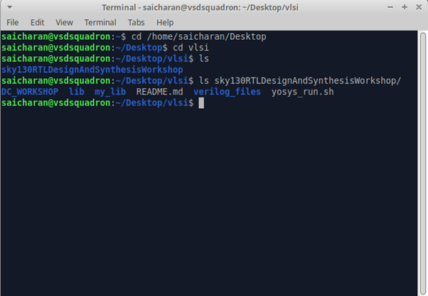

The key folders:
- `verilog_files/` — all design and testbench `.v` files
- `lib/` — SKY130 standard cell library (`.lib` file used during synthesis)
- `my_lib/` — local copy of cell modules

---

## 🔬 Lab 2 — Simulation with iverilog and GTKWave

### Design Used: `good_latch`

For this lab, `good_latch.v` is used — a level-sensitive latch with clock enable and reset. This is a good introductory design because a latch demonstrates level-sensitive behavior (output follows input while enable is high), which is clearly visible in waveforms.

Navigate to the verilog_files directory:

```bash
cd sky130RTLDesignAndSynthesisWorkshop/verilog_files
```

### Step 1 — Compile and Simulate

The syntax for iverilog is:

```bash
iverilog <design_file> <testbench_file>
```

Running it for `good_latch`:

```bash
iverilog good_latch.v tb_good_latch.v
./a.out
```

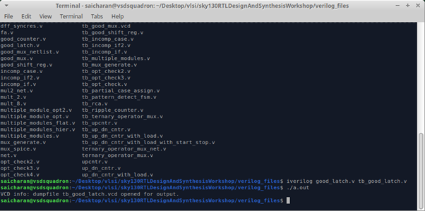

`iverilog` compiles both files and produces `a.out`. Running `./a.out` executes the simulation and dumps the `.vcd` waveform file (`tb_good_latch.vcd`).

### Step 2 — Load Waveform in GTKWave

```bash
gtkwave tb_good_latch.vcd
```

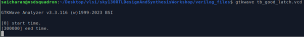

GTKWave opens the waveform viewer:

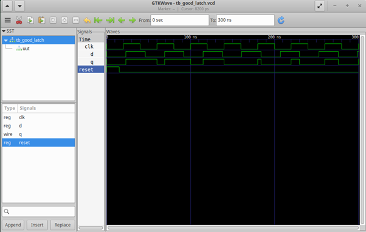

Signals visible: `clk`, `d`, `q`, `reset`. The waveform confirms the latch behavior — `q` follows `d` when the clock enable is active, and resets to 0 when `reset` is asserted.

### Viewing the Design and Testbench Files

To view the RTL source and testbench code:

```bash
gvim good_latch.v
gvim tb_good_latch.v
```

> These files are part of the VSD workshop repository. Refer to the cloned `verilog_files/` directory to inspect them.

---

## 🔴 Introduction to Yosys and Logic Synthesis

Yosys is an open-source logic synthesis framework. It reads RTL Verilog, maps it to standard cells from a `.lib` library, and produces a gate-level netlist.

The full synthesis command sequence inside Yosys:

| Command | Purpose |
|---|---|
| `read_liberty -lib <path>.lib` | Load the standard cell library |
| `read_verilog <design>.v` | Read the RTL design |
| `synth -top <module>` | Synthesize and report cell usage |
| `abc -liberty <path>.lib` | Map to actual SKY130 standard cells |
| `show` | Display gate-level schematic |
| `write_verilog -noattr <netlist>.v` | Write clean netlist (no attributes) |

The `-noattr` flag strips internal Yosys metadata from the netlist, producing a clean, readable output useful for review and further analysis.

---

## 🔬 Lab 3 — Synthesizing good_latch with Yosys

Launch Yosys from the `verilog_files` directory:

```bash
yosys
```

### Step 1 — Read Library and Design

```
read_liberty -lib ../lib/sky130_fd_sc_hd__tt_025C_1v80.lib
read_verilog good_latch.v
```

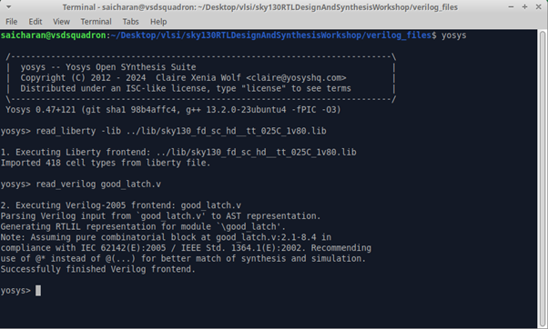

Yosys confirms it imported **418 cell types** from the SKY130 library and successfully parsed `good_latch.v`.

### Step 2 — Synthesize

```
synth -top good_latch
```

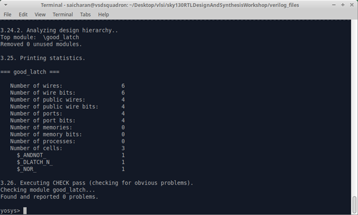

The synthesis report shows `good_latch` was mapped to **3 cells**:
- `$_ANDNOT_` × 1
- `$_DLATCH_N_` × 1
- `$_NOR_` × 1

### Step 3 — Technology Mapping with ABC

```
abc -liberty ../lib/sky130_fd_sc_hd__tt_025C_1v80.lib
```

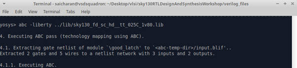

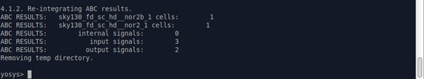

ABC maps the design to SKY130 cells:
- `sky130_fd_sc_hd__nor2b_1` × 1
- `sky130_fd_sc_hd__nor2_1` × 1

### Step 4 — View Gate-Level Schematic

```
show
```

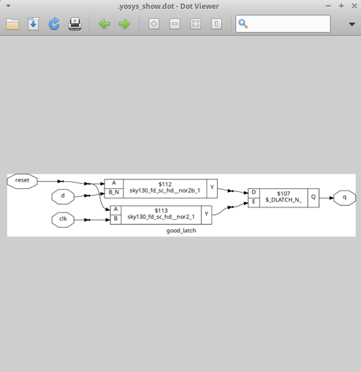

The schematic shows `reset`, `d`, and `clk` feeding through two NOR gates into a `$_DLATCH_N_` standard cell, driving the output `q`.

### Step 5 — Write Netlist

```
write_verilog -noattr good_latch_netlist.v
```

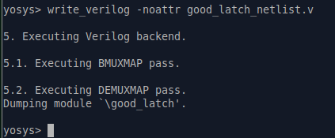

To view the generated netlist from within the Yosys shell:

```
!gvim good_latch_netlist.v
```

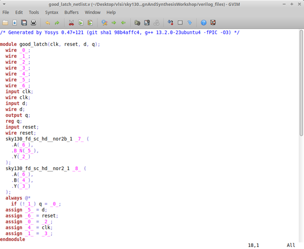

The `-noattr` netlist is clean and readable — SKY130 cell instantiations are directly visible without internal Yosys metadata.

---

## 🔍 Manual Realization — good_latch

After viewing the synthesized schematic (`show`) and the generated netlist (`good_latch_netlist.v`), the gate-level logic was manually traced and verified.

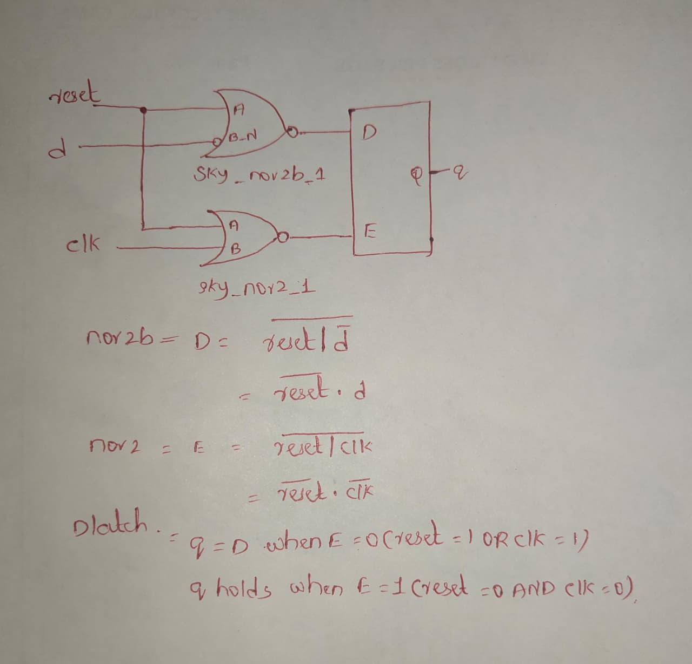

### Verified connections from netlist

| Wire | Signal | Role |
|---|---|---|
| `_6_` | `reset` | Input — feeds A of both gates |
| `_5_` | `d` | Input — feeds B_N of NOR2B only |
| `_4_` | `clk` | Input — feeds B of NOR2 only |
| `_2_` | NOR2B output Y | → D input of DLATCH_N |
| `_3_` | NOR2 output Y | → E input of DLATCH_N |

### Boolean derivation

**Gate 1 — `sky130_fd_sc_hd__nor2b_1`**
```
D = !(reset | !d)
  = !reset · d
```
> The `b` in `nor2b` means B input is internally inverted (B_N). Yosys chose this cell to avoid a separate inverter — more efficient than NOR2 + NOT.

**Gate 2 — `sky130_fd_sc_hd__nor2_1`**
```
E = !(reset | clk)
  = !reset · !clk
```

**DLATCH_N (active-low enable)**
```
q = D   when E = 0  →  when reset=1 OR clk=1   (latch transparent)
q holds when E = 1  →  when reset=0 AND clk=0  (latch closed)
```

### Verification truth table

| reset | clk | d | D = !reset·d | E = !reset·!clk | q |
|---|---|---|---|---|---|
| 1 | x | x | 0 | 0 | 0 — reset forces q=0 ✅ |
| 0 | 1 | 0 | 0 | 0 | 0 — transparent, follows D ✅ |
| 0 | 1 | 1 | 1 | 0 | 1 — transparent, follows D ✅ |
| 0 | 0 | x | x | 1 | holds last value ✅ |

Synthesis verified ✅ — gate-level output matches RTL behavior exactly.

---

## ✅ Summary

| Task | Tool | Output |
|---|---|---|
| Compile + simulate RTL | `iverilog` | `a.out` + `tb_good_latch.vcd` |
| View waveforms | `GTKWave` | Signal behavior verified visually |
| Synthesize RTL to gates | `Yosys` + SKY130 lib | Gate-level netlist |
| View schematic | `Yosys show` | Gate diagram with SKY130 cells |
| Export clean netlist | `write_verilog -noattr` | `good_latch_netlist.v` |

Day 1 establishes the complete simulation-to-synthesis flow that will be used throughout the rest of the workshop.

---

> 🔙 **Back to main repo:** [RTL-Design-Workshop](../README.md)