# Day 2 — Timing Libraries, Hierarchical vs Flat Synthesis & Flip-Flop Coding Styles


---

## 📑 Table of Contents

1. [🧠 Timing Library Walkthrough](#-timing-library-walkthrough)
2. [🔬 Lab 1 — Hierarchical vs Flat Synthesis](#-lab-1--hierarchical-vs-flat-synthesis)
3. [🔴 Lab 2 — Flip-Flop Coding Styles, Simulation & Synthesis](#-lab-2--flip-flop-coding-styles-simulation--synthesis)
4. [✅ Lab 3 — Interesting RTL Synthesis (mul2 & mult8)](#-lab-3--interesting-rtl-synthesis-mul2--mult8)
5. [📊 Summary Table](#-summary-table)

---

## 🧠 Timing Library Walkthrough

> *(Refer Day-1 for simulation flow basics and Yosys command overview)*

### What is a `.lib` file?

A `.lib` (Liberty) file is the standard cell library used by synthesis tools. It contains timing, power, and area information for every standard cell — telling the tool exactly how fast, how power-hungry, and how large each gate is under a specific set of operating conditions.

The library used throughout this workshop is:

```
sky130_fd_sc_hd__tt_025C_1v80.lib
```

### Decoding the Library Name — PVT Corners

The library name encodes the **PVT (Process, Voltage, Temperature)** corner:

| Field | Value | Meaning |
|---|---|---|
| `tt` | Typical | Typical process corner — neither fast nor slow silicon |
| `025C` | 25°C | Nominal operating temperature |
| `1v80` | 1.8 V | Nominal supply voltage |

PVT corners matter because transistor behaviour changes with process variation, supply voltage, and temperature. A design verified at the `tt_025C_1v80` corner represents nominal operating conditions.

### Opening the Library in gvim

```bash
cd ~/Desktop/vlsi/sky130RTLDesignAndSynthesisWorkshop/lib
gvim ../lib/sky130_fd_sc_hd__tt_025C_1v80.lib
```

Inside gvim, turn off syntax highlighting for readability:

```
:syn off
```

The top of the `.lib` file shows the global operating conditions and unit definitions:

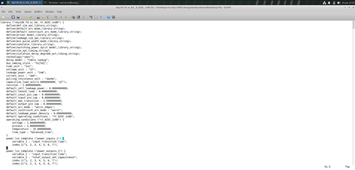

Key fields visible at the top of the file:

```
technology("cmos");
delay_model : "table_lookup";
time_unit : "1ns";
voltage_unit : "1V";
leakage_power_unit : "1nW";
current_unit : "1mA";
operating_conditions ("tt_025C_1v80") {
    voltage   : 1.8000000000;
    process   : 1.0000000000;
    temperature : 25.000000000;
}
```

Each cell entry in the library contains area, leakage power, and per-pin timing arcs. Cells come in multiple **flavours** — for example, `and2_0`, `and2_1`, `and2_2` — representing different drive strengths. A stronger drive strength cell is physically larger and draws more power, but switches faster.

---

## 🔬 Lab 1 — Hierarchical vs Flat Synthesis

### Design: `multiple_modules.v`

`multiple_modules.v` instantiates two sub-modules:
- `sub_module1` — implements an AND gate: `y = a & b`
- `sub_module2` — implements an OR gate: `y = a | b`
- Top-level expression: **Y = (A · B) + C**

```verilog
module sub_module1 (input a, input b, output y);
    assign y = a & b;
endmodule

module sub_module2 (input a, input b, output y);
    assign y = a | b;
endmodule

module multiple_modules (input a, input b, input c, output y);
    wire net1;
    sub_module1 u1 (.a(a), .b(b), .y(net1));
    sub_module2 u2 (.a(net1), .b(c), .y(y));
endmodule
```

---

### Hierarchical Synthesis

```bash
cd ~/Desktop/vlsi/sky130RTLDesignAndSynthesisWorkshop/verilog_files
yosys
read_liberty -lib ../lib/sky130_fd_sc_hd__tt_025C_1v80.lib
read_verilog multiple_modules.v
synth -top multiple_modules
```

The synthesis statistics confirm the design hierarchy is preserved — `sub_module1` and `sub_module2` are listed as separate entries:

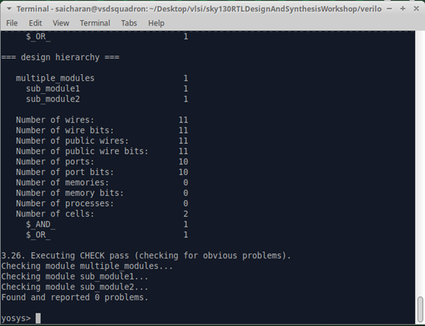

```bash
abc -liberty ../lib/sky130_fd_sc_hd__tt_025C_1v80.lib
show multiple_modules
```

The hierarchical schematic shows `sub_module1` and `sub_module2` as **black boxes** — the tool has not expanded them:

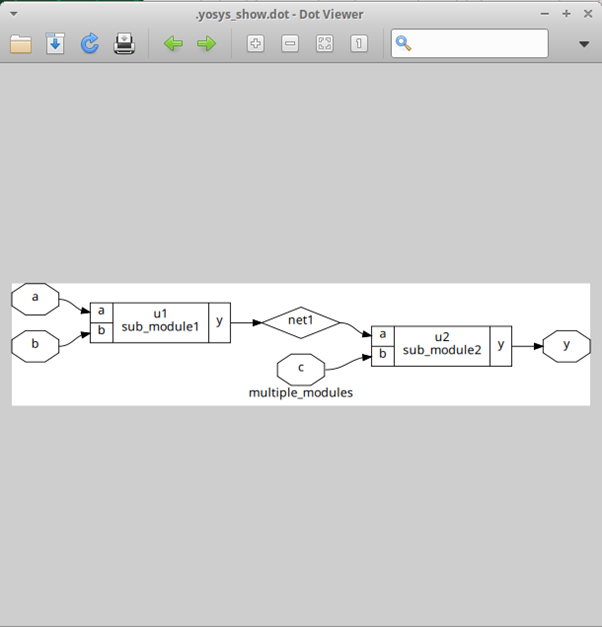

Writing and viewing the hierarchical netlist:

```bash
write_verilog -noattr multiple_modules_hier_netlist.v
!gvim multiple_modules_hier_netlist.v
```

The generated netlist contains explicit sub-module instantiations — `sub_module1 u1` and `sub_module2 u2` are visible as separate module instances:

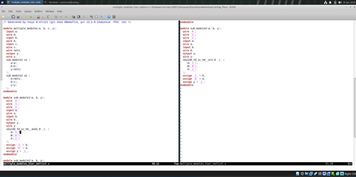

---

### Flat Synthesis

```bash
flatten
show
```

After `flatten`, the hierarchy collapses. Both AND and OR cells are now directly instantiated under `multiple_modules` — no sub-module boundaries remain:

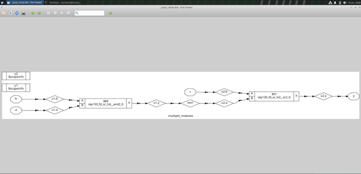

```bash
write_verilog -noattr multiple_modules_flat_netlist.v
!gvim multiple_modules_flat_netlist.v
```

The flattened netlist contains a single `multiple_modules` module with both cells instantiated directly:

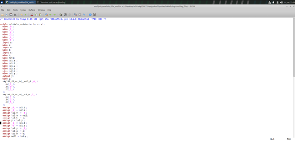

---

### Hierarchical vs Flat — Side-by-Side Comparison

| Aspect | Hierarchical | Flattened |
|---|---|---|
| Hierarchy | Preserved — sub-modules intact | Collapsed — single flat module |
| Netlist structure | `sub_module1 u1`, `sub_module2 u2` instances | `sky130_fd_sc_hd__and2_0`, `sky130_fd_sc_hd__or2_0` directly |
| Schematic | Black-box sub-modules | All gates fully visible |
| Cross-module optimisation | Not possible | Enabled |
| Debugging ease | Easier — maps to RTL hierarchy | Harder — no module boundaries |
| Runtime on large designs | Faster | Slower |
| **Boolean expression** | **Y = (A · B) + C** | **Y = (A · B) + C** |

> **Key takeaway:** The logic is identical. `flatten` changes the structural representation, not the function.

---

### Sub-module Level Synthesis

Instead of synthesising the top module, Yosys can be directed to synthesise only one sub-module at a time. This is useful for:
- Very large designs where synthesising the full top-level is time-consuming
- Designs with repeated instances — synthesise once, reuse
- Isolating and verifying individual blocks

```bash
yosys
read_liberty -lib ../lib/sky130_fd_sc_hd__tt_025C_1v80.lib
read_verilog multiple_modules.v
synth -top sub_module1
```

The statistics show only `sub_module1` is synthesised — 1 cell (`$AND_`):

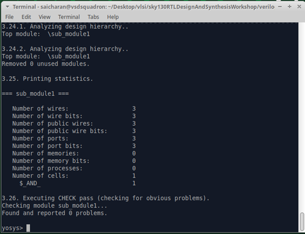

```bash
abc -liberty ../lib/sky130_fd_sc_hd__tt_025C_1v80.lib
show
```

The schematic shows only `sub_module1` — a single `sky130_fd_sc_hd__and2_0`, titled `sub_module1`. The rest of the design is not present:

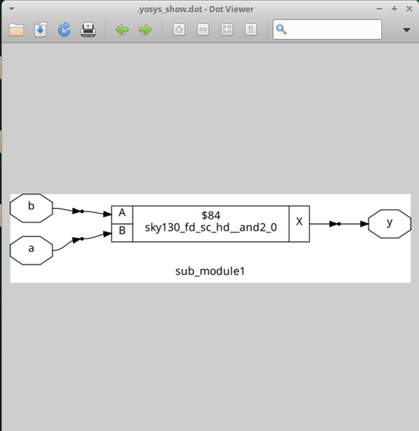

---

## 🔴 Lab 2 — Flip-Flop Coding Styles, Simulation & Synthesis

> *(Refer Day-1 for iverilog and GTKWave basics)*

This lab covers three D flip-flop variants — simulated first with iverilog/GTKWave, then synthesised with Yosys — exploring how coding style differences map to different SKY130 cells.

### Why flip-flops need special attention in Yosys

Synthesis tools infer flip-flops from `always @(posedge clk)` blocks. However, **the sensitivity list** determines whether the reset/set is asynchronous or synchronous — this directly affects which SKY130 cell is chosen during technology mapping.

> **Note on `dfflibmap`:** This command is required when synthesising flip-flops. It maps inferred DFF primitives to technology-specific cells from the liberty library. Standard organisations keep flip-flop cells in a separate library from combinational cells — `dfflibmap` points Yosys to the right entries. In this workshop both live in the same `sky130_fd_sc_hd__tt_025C_1v80.lib`, so the same library path is used for both commands.

---

### 2.1 — Asynchronous Reset D Flip-Flop (`dff_asyncres`)

```verilog
module dff_asyncres (input clk, input async_reset, input d, output reg q);
    always @ (posedge clk, posedge async_reset)
        if (async_reset)
            q <= 1'b0;
        else
            q <= d;
endmodule
```

**Key coding style:** `async_reset` appears in the sensitivity list — it does not wait for a clock edge.

#### Simulation

```bash
iverilog dff_asyncres.v tb_dff_asyncres.v
./a.out
gtkwave tb_dff_asyncres.vcd
```


**Waveform observation:** When `async_reset` goes HIGH, `q` immediately goes LOW — independent of the clock edge. When `async_reset` is LOW, `q` tracks `d` at the rising clock edge.

#### Synthesis

```bash
yosys
read_liberty -lib ../lib/sky130_fd_sc_hd__tt_025C_1v80.lib
read_verilog dff_asyncres.v
synth -top dff_asyncres
dfflibmap -liberty ../lib/sky130_fd_sc_hd__tt_025C_1v80.lib
abc -liberty ../lib/sky130_fd_sc_hd__tt_025C_1v80.lib
show
```

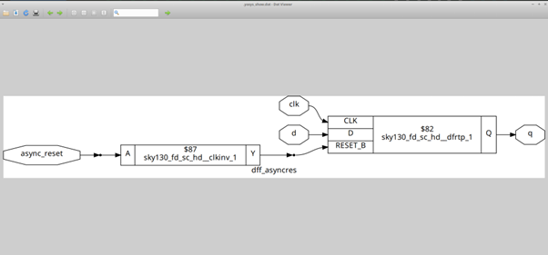

**Schematic analysis:**
- Cell used: `sky130_fd_sc_hd__dfrtp_1` — DFF with active-low asynchronous reset (`RESET_B`)
- The `async_reset` input (active-high in RTL) is passed through `sky130_fd_sc_hd__clkinv_1` before feeding `RESET_B`

**Why the inverter?** The RTL says `if (async_reset)` — reset is active-high. But `dfrtp_1`'s `RESET_B` is active-low. Yosys inserts the inverter automatically to match polarities.

```
async_reset → [clkinv_1] → RESET_B of dfrtp_1
```

---

### 2.2 — Asynchronous Set D Flip-Flop (`dff_async_set`)

```verilog
module dff_async_set (input clk, input async_set, input d, output reg q);
    always @ (posedge clk, posedge async_set)
        if (async_set)
            q <= 1'b1;
        else
            q <= d;
endmodule
```

#### Simulation

```bash
iverilog dff_async_set.v tb_dff_async_set.v
./a.out
gtkwave tb_dff_async_set.vcd
```

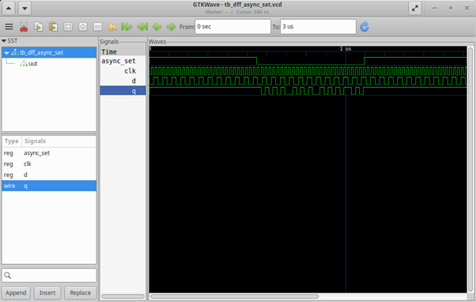

**Waveform observation:** When `async_set` goes HIGH, `q` immediately goes HIGH — no clock edge required. The behaviour is clock-independent, just as with `dff_asyncres`, but `q` is driven to 1 instead of 0.

#### Synthesis

```bash
read_verilog dff_async_set.v
synth -top dff_async_set
dfflibmap -liberty ../lib/sky130_fd_sc_hd__tt_025C_1v80.lib
abc -liberty ../lib/sky130_fd_sc_hd__tt_025C_1v80.lib
show
```

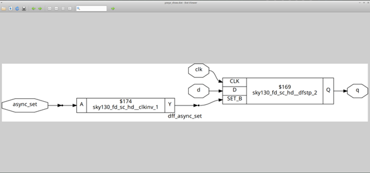

**Schematic analysis:**
- Cell used: `sky130_fd_sc_hd__dfstp_2` — DFF with active-low asynchronous set (`SET_B`)
- Same inverter pattern as asyncres — `async_set` is inverted through `clkinv_1` before feeding `SET_B`

```
async_set → [clkinv_1] → SET_B of dfstp_2
```

---

### 2.3 — Synchronous Reset D Flip-Flop (`dff_syncres`)

```verilog
module dff_syncres (input clk, input async_reset, input sync_reset, input d, output reg q);
    always @ (posedge clk)
        if (sync_reset)
            q <= 1'b0;
        else
            q <= d;
endmodule
```

**Key coding style:** Only `posedge clk` in the sensitivity list — `sync_reset` is sampled at the clock edge, not immediately.

#### Simulation

```bash
iverilog dff_syncres.v tb_dff_syncres.v
./a.out
gtkwave tb_dff_syncres.vcd
```

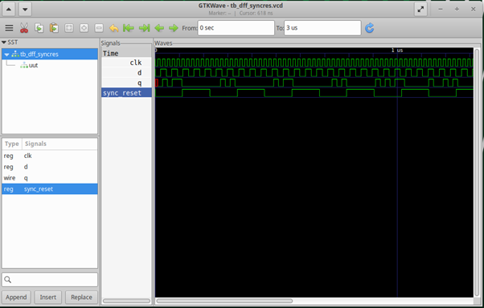

**Waveform observation:** Even when `sync_reset` goes HIGH mid-cycle, `q` does not change immediately — it waits for the next rising clock edge. This is the fundamental difference between synchronous and asynchronous control.

#### Synthesis

```bash
read_verilog dff_syncres.v
synth -top dff_syncres
dfflibmap -liberty ../lib/sky130_fd_sc_hd__tt_025C_1v80.lib
abc -liberty ../lib/sky130_fd_sc_hd__tt_025C_1v80.lib
show
```

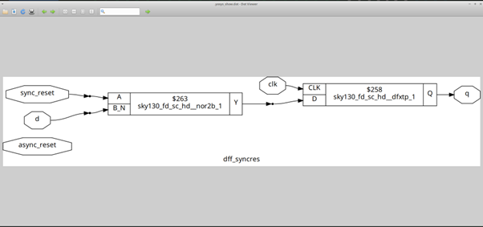

**Schematic analysis:**
- Cell used: `sky130_fd_sc_hd__dfxtp_1` — a **plain DFF with no reset pin at all**
- Cell used for reset logic: `sky130_fd_sc_hd__nor2b_1`
- `sync_reset` and `d` feed the `nor2b_1` gate, whose output connects to the `D` input of `dfxtp_1`

**Why no reset pin?** The reset is synchronous — it only needs to act at the clock edge, so it is implemented as combinational logic on the `D` input:

```
D_in = !(sync_reset | !d) = !sync_reset · d   [NOR2B gate]
dfxtp_1: q ← D_in at posedge clk
```

When `sync_reset = 1`: `D_in = 0` → `q = 0` at next clock edge  
When `sync_reset = 0`: `D_in = d` → `q = d` at next clock edge

**Note:** `async_reset` is present as a port in the RTL but unused in the `always` block — it appears as a floating unconnected port in the synthesized netlist.

---

### Flop Summary — Async vs Sync

| Property | Async Reset/Set | Sync Reset |
|---|---|---|
| Sensitivity list | `posedge clk, posedge reset` | `posedge clk` only |
| Reset timing | Immediate — no clock needed | Only at clock edge |
| Glitch sensitivity | Higher | Lower |
| SKY130 DFF cell | `dfrtp_1` / `dfstp_2` | `dfxtp_1` |
| Additional cell | `clkinv_1` (polarity match) | `nor2b_1` (combinational reset at D) |
| Use case | Hard resets, power-on init | Normal design resets |

---

## ✅ Lab 3 — Interesting RTL Synthesis (mul2 & mult8)

This lab demonstrates a critical insight: **not all RTL requires standard cells**. Some operations are pure rewiring.

### 3.1 — mul2 (Multiply by 2)

```verilog
module mul2 (input [2:0] a, output [3:0] y);
    assign y = a * 2;
endmodule
```

```bash
yosys
read_liberty -lib ../lib/sky130_fd_sc_hd__tt_025C_1v80.lib
read_verilog mult_2.v
synth -top mul2
```

The synthesis statistics show **0 standard cells**:

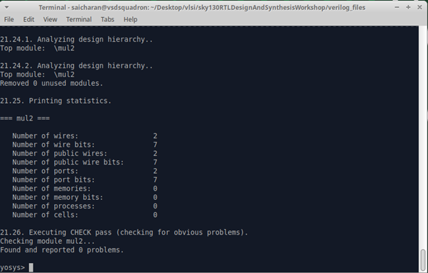

```bash
abc -liberty ../lib/sky130_fd_sc_hd__tt_025C_1v80.lib
show
```

The schematic is a wire-only connection block — no gates at all:

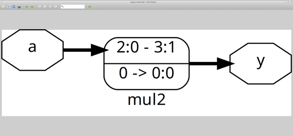

```bash
write_verilog -noattr mult_2_netlist.v
!gvim mult_2_netlist.v
```

The generated netlist confirms it — just a single `assign` statement, no cell instances:

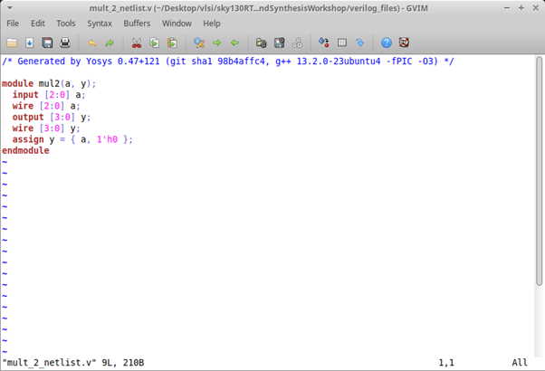

**Why 0 cells?** Multiplying a binary number by 2 is a left shift by 1 bit:

```
y = a * 2 = a << 1 = {a[2:0], 1'b0}
```

| Output | Source |
|---|---|
| `y[3]` | `a[2]` |
| `y[2]` | `a[1]` |
| `y[1]` | `a[0]` |
| `y[0]` | `GND` (hardwired 0) |

This is pure wiring — no logic gate can do it more efficiently than a wire. Yosys correctly infers this and produces zero cells.

---

### 3.2 — mult8 (Multiply by 9)

```verilog
module mult8 (input [2:0] a, output [5:0] y);
    assign y = a * 9;
endmodule
```

```bash
yosys
read_liberty -lib ../lib/sky130_fd_sc_hd__tt_025C_1v80.lib
read_verilog mult_8.v
synth -top mult8
```

The synthesis terminal confirms **0 cells** — ABC extracts 0 gates:

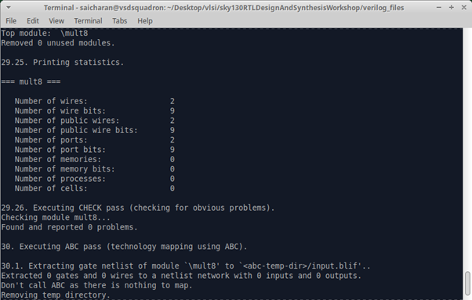

```bash
abc -liberty ../lib/sky130_fd_sc_hd__tt_025C_1v80.lib
show
```

The schematic shows `2x 2:0 → 5:0` — each input bit fans out to two output bits:

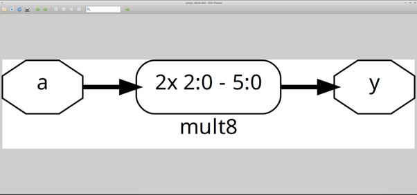

**Why 0 cells?** 9 = 8 + 1, so:

```
a * 9 = (a * 8) + (a * 1) = (a << 3) + a = {a[2:0], a[2:0]}
```

Concatenating `a` with itself produces the 6-bit result with no arithmetic logic required:

| Output | Source |
|---|---|
| `y[5]` | `a[2]` |
| `y[4]` | `a[1]` |
| `y[3]` | `a[0]` |
| `y[2]` | `a[2]` |
| `y[1]` | `a[1]` |
| `y[0]` | `a[0]` |

Each input bit fans to two output wires — a pure wiring solution once again.

---

### mul2 vs mult8 — Comparison

| Property | mul2 | mult8 |
|---|---|---|
| Operation | `a * 2` | `a * 9` |
| Equivalent | `a << 1` | `{a, a}` |
| Input width | 3-bit | 3-bit |
| Output width | 4-bit | 6-bit |
| Cells inferred | 0 | 0 |
| Special wire | `y[0]` tied to GND | Each `a[i]` fans to two outputs |
| Netlist | `assign y = {a, 1'h0}` | `assign y = {a, a}` |

---

## 📊 Summary Table

| Lab | Design | Tool Flow | Key Observation |
|---|---|---|---|
| 1a | `multiple_modules` | `synth -top multiple_modules` | Sub-modules preserved as black boxes in hierarchy |
| 1b | `multiple_modules` | `flatten` then `show` | Hierarchy collapsed — single flat netlist, same logic |
| 1c | `sub_module1` | `synth -top sub_module1` | Only AND gate synthesised — partial synthesis demonstrated |
| 2a | `dff_asyncres` | iverilog + GTKWave → Yosys + dfflibmap | Async reset: immediate `q` change; mapped to `dfrtp_1` + `clkinv_1` |
| 2b | `dff_async_set` | iverilog + GTKWave → Yosys + dfflibmap | Async set: immediate `q` change; mapped to `dfstp_2` + `clkinv_1` |
| 2c | `dff_syncres` | iverilog + GTKWave → Yosys + dfflibmap | Sync reset: `q` changes only at clock edge; mapped to `dfxtp_1` + `nor2b_1` |
| 3a | `mul2` | Yosys synth + show | 0 cells — multiply-by-2 is a left shift, pure wiring |
| 3b | `mult8` | Yosys synth + show | 0 cells — multiply-by-9 is `{a,a}`, each bit fans to two outputs |

---

[← Back to Main Repository](https://github.com/Saicharan-malyala/RTL-Design-Workshop)