# Day 3 — Combinational and Sequential Optimizations


---

## Table of Contents

- [Overview](#overview)
- [Section A — Combinational Logic Optimization](#section-a--combinational-logic-optimization)
  - [Lab: opt_check — AND Gate Reduction](#lab-opt_check--and-gate-reduction)
  - [Lab: opt_check2 — OR Gate Reduction](#lab-opt_check2--or-gate-reduction)
  - [Lab: opt_check3 — Multi-Level Reduction](#lab-opt_check3--multi-level-reduction)
  - [Lab Assignment: opt_check4 — XNOR Reduction](#lab-assignment-opt_check4--xnor-reduction)
  - [Lab Assignment: multiple_module_opt — Flatten Before Optimize](#lab-assignment-multiple_module_opt--flatten-before-optimize)
- [Section B — Sequential Logic Optimization](#section-b--sequential-logic-optimization)
  - [Lab: dff_const1 — Flop Retained](#lab-dff_const1--flop-retained)
  - [Lab: dff_const2 — Flop Eliminated](#lab-dff_const2--flop-eliminated)
  - [Lab: dff_const3 — Both Flops Retained](#lab-dff_const3--both-flops-retained)
  - [Lab Assignment: dff_const4 — Both Flops Eliminated](#lab-assignment-dff_const4--both-flops-eliminated)
  - [Lab Assignment: dff_const5 — Both Flops Retained](#lab-assignment-dff_const5--both-flops-retained)
- [Section C — Unused Output Optimization](#section-c--unused-output-optimization)
  - [Lab: counter_opt — 1-Bit Counter Reduction](#lab-counter_opt--1-bit-counter-reduction)
  - [Lab: counter_opt2 — Full 3-Bit Counter](#lab-counter_opt2--full-3-bit-counter)
- [Summary Table](#summary-table)
- [Back to Main Repo](#back-to-main-repo)

---

## Overview

Day 3 focuses on logic optimization — what Yosys does beyond just mapping RTL to gates. Two core techniques are covered:

**Constant propagation** traces a known-constant signal forward through the circuit. Any logic whose output is fully determined by that constant gets replaced or removed. A mux with one input permanently tied to 0 is just an AND gate. A flip-flop whose output can never change is just a wire to VCC or GND.

**Unused output elimination** works from the output side. If only some bits of an internal bus drive the module output, the logic computing the other bits is dead weight. Yosys identifies and removes it, which can dramatically reduce flop count.

Both techniques together mean that the synthesized netlist can look very different from the RTL — simpler, smaller, and cheaper to implement on silicon.

> *(Refer Day-1 for iverilog simulation flow, GTKWave basics, and Yosys command reference)*
> *(Refer Day-2 for `dfflibmap` usage and flip-flop coding styles)*

---

## Section A — Combinational Logic Optimization

The key command introduced here is `opt_clean -purge`. After `synth` resolves the RTL into an internal gate representation, `opt_clean -purge` sweeps through and removes any cells or wires that became redundant due to constant folding. Running it before `abc` means the technology mapper gets a cleaner netlist to work with.

```bash
# Flow for all combinational optimization labs
yosys
read_liberty -lib ../lib/sky130_fd_sc_hd__tt_025C_1v80.lib
read_verilog <design>.v
synth -top <module>
opt_clean -purge
abc -liberty ../lib/sky130_fd_sc_hd__tt_025C_1v80.lib
show
```

---

### Lab: opt_check — AND Gate Reduction

**RTL:** `assign y = a ? b : 0;`

Before running synthesis, I analyzed this manually. When `a = 0`, the mux selects the constant 0 regardless of what `b` is. So the only time `y` can be 1 is when both `a = 1` and `b = 1`. That is the definition of a 2-input AND operation. The mux is unnecessary.

**Synthesis stats:**

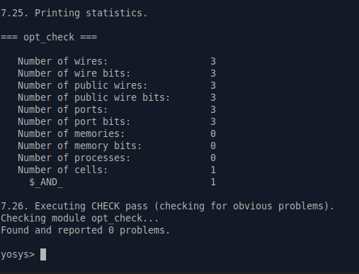

The stats confirm what I expected. Under `=== opt_check ===`, Yosys reports exactly 1 cell: `$_AND_`. Three wires are listed (corresponding to inputs `a`, `b` and output `y`), and the cell count is 1. There are no memory elements, no processes left — a clean single-gate result. The `opt_clean -purge` step successfully removed the mux structure and left only the AND primitive, which `abc` then maps to a SKY130 standard cell.

**Schematic:**

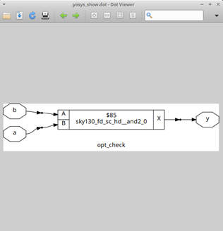

The dot viewer shows exactly one cell: `sky130_fd_sc_hd__and2_0` (a 2-input AND gate, drive strength 0). Input `b` connects to pin `A`, input `a` connects to pin `B`, and the output `X` drives `y`. What is interesting here is that the mux from the RTL has completely disappeared — there is no MUX cell, no selector logic, nothing. The constant propagation folded the entire conditional into a single AND gate, exactly as the manual analysis predicted.

---

### Lab: opt_check2 — OR Gate Reduction

**RTL:** `assign y = a ? 1 : b;`

When `a = 1`, the mux always outputs 1. When `a = 0`, the output follows `b`. So `y` is 0 only when both `a = 0` and `b = 0` — which is OR behavior. I expected a single OR gate.

**Synthesis stats:**

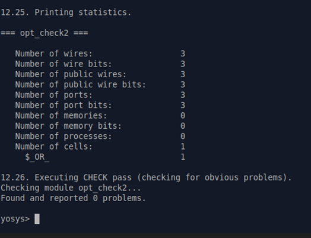

The stats show `$_OR_: 1` under the cell count. Same wire and port count as opt_check — 3 wires, 3 ports, 1 cell. The pattern is consistent: one constant input to a mux always collapses to a 2-input gate. When the constant is 0 (on the false branch), it becomes AND. When the constant is 1 (on the true branch), it becomes OR.

**Schematic:**

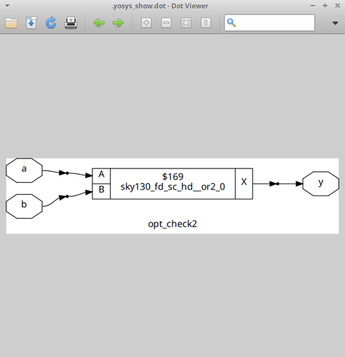

The schematic shows `sky130_fd_sc_hd__or2_0` (2-input OR, drive strength 0). Input `a` connects to pin `A`, input `b` connects to pin `B`, and `X` drives `y`. Again, the mux is gone. I notice that compared to opt_check, the input ordering on the pins is swapped (`a` on `A`, `b` on `B`) — this is just how Yosys assigns pins, it does not affect functionality. The OR gate is the correct and minimal implementation.

---

### Lab: opt_check3 — Multi-Level Reduction

**RTL:** `assign y = a ? (c ? b : 0) : 0;`

This has two nested muxes. I traced it level by level. The inner expression `c ? b : 0` reduces to `c & b` by the same rule as opt_check. The outer expression `a ? (c & b) : 0` then reduces to `a & (c & b)`, which is just `a & b & c`. A 3-input AND.

**Synthesis stats:**

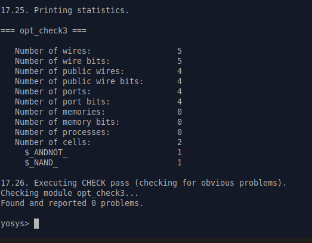

The stats report 2 cells: `$_ANDNOT_: 1` and `$_NAND_: 1`. This is the intermediate representation after `synth` and `opt_clean` but before `abc` runs the technology mapping. Yosys internally broke the 3-input AND into a NAND followed by an ANDNOT, which are efficient primitives in its internal library. Once `abc` maps these to the SKY130 library, they combine into a single `and3` cell. The port count is 4 (inputs `a`, `b`, `c` and output `y`) — consistent with a 3-input gate.

**Schematic:**

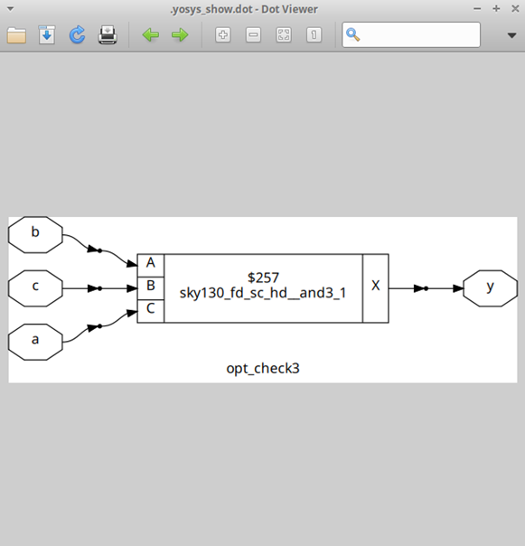

After `abc` maps to SKY130, a single `sky130_fd_sc_hd__and3_1` cell appears. All three inputs `a`, `b`, `c` connect to pins `A`, `B`, `C` respectively, and `X` drives `y`. The two nested mux levels from the RTL have been completely absorbed into one standard cell. This is multi-level constant propagation in action — `opt_clean` kept folding constants at each mux level until nothing remained except the core boolean expression.

---

### Lab Assignment: opt_check4 — XNOR Reduction

**RTL:** `assign y = a ? (b ? (a & c) : c) : (!c);`

This one required careful tracing. When `a = 1`: the outer mux selects `b ? (a & c) : c`. Since `a = 1`, `a & c` simplifies to `c`. So this becomes `b ? c : c` — which is just `c`, regardless of `b`. When `a = 0`: the outer mux selects `!c`. So the full expression is: `y = a ? c : !c`, which is `a XNOR c`. Input `b` turns out to have no effect on the output at all.

**Synthesis stats:**

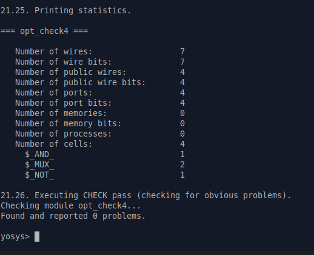

The stats show 4 cells at the intermediate stage: `$_AND_: 1`, `$_MUX_: 2`, `$_NOT_: 1`. This makes sense — Yosys resolved the RTL into its internal primitives but has not yet run the full optimization to collapse them. After `abc` maps to SKY130, these 4 primitives merge into a single `xnor2` cell. The port count is 4 (inputs `a`, `b`, `c` and output `y`).

**Schematic:**

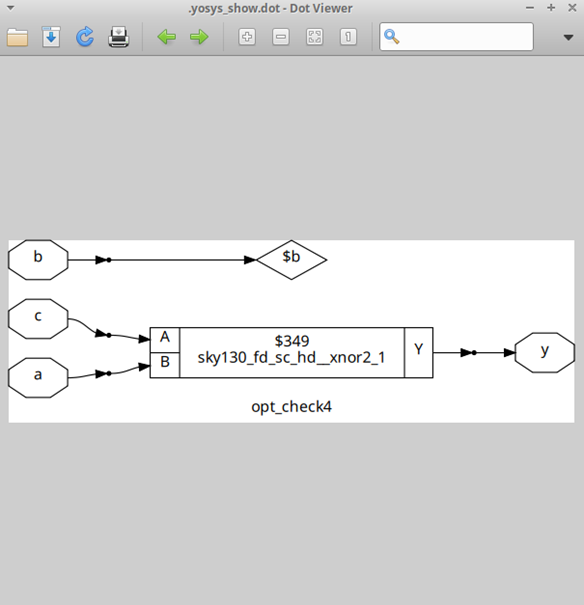

The schematic is the most revealing of all the opt_check series. The cell `sky130_fd_sc_hd__xnor2_1` has inputs `a` on pin `A` and `c` on pin `B`, with output `Y` driving `y`. But look at `b` — it appears as a floating diamond node `$b` that connects to nothing. Yosys traced through the logic, proved that `b` cannot affect `y` under any combination of inputs, and isolated it completely. The RTL had `b` in the expression but the synthesized circuit has no use for it. This is a powerful demonstration of how constant propagation and Boolean simplification together can expose redundant inputs that would be hard to spot by manual inspection.

---

### Lab Assignment: multiple_module_opt — Flatten Before Optimize

When a design has a module hierarchy, `opt_clean` operating on the top module cannot see inside instantiated submodules. The optimization is blocked at the module boundary. The solution is `flatten` — it inlines all submodule logic into the top level before `opt_clean` runs, giving the optimizer a complete view of the circuit.

```bash
yosys
read_liberty -lib ../lib/sky130_fd_sc_hd__tt_025C_1v80.lib
read_verilog multiple_module_opt.v
synth -top multiple_module_opt
flatten
opt_clean -purge
abc -liberty ../lib/sky130_fd_sc_hd__tt_025C_1v80.lib
write_verilog -noattr multiple_module_opt_net.v
show
```

**Synthesis stats:**

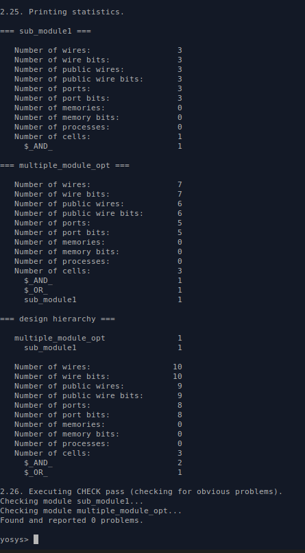

The stats are worth reading carefully. Before `flatten`, Yosys reports the hierarchy separately: `sub_module1` has 1 `$_AND_` cell, and `multiple_module_opt` shows 3 cells with `sub_module1` still listed as an instance. After `flatten`, the hierarchy disappears and the design collapses to 2 cells at the top level: `$_AND_` and `$_OR_`. The `design hierarchy` section at the bottom confirms `multiple_module_opt` now contains everything inline. The wire count jumps from 7 to 10 during flattening — those are the internal submodule connections now exposed as top-level wires before `opt_clean` can prune them.

**Schematic:**

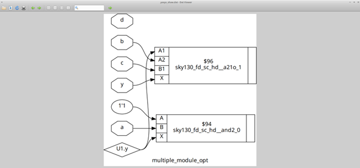

The post-flatten, post-optimization schematic shows two cells. The upper cell is `sky130_fd_sc_hd__a21o_1` — this is an AND-OR cell, specifically `(A1 & A2) | B1`. Inputs `b` and `c` connect to `A1` and `A2`, input `y` (an intermediate signal from the submodule) connects to `B1`, and the output drives the top-level `y` port. The lower cell is `sky130_fd_sc_hd__and2_0` with `1'1` and input `a` — this is computing the submodule's internal AND result, which feeds into `U1.y`. The diamond node `U1.y` is the flattened internal wire from `sub_module1`. Input `d` is visible as an isolated node at the top, indicating it has no effect on the output after optimization. Without `flatten`, Yosys could not have discovered that `d` was redundant across the module boundary.

**Generated netlist (write_verilog output):**

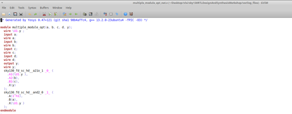

The netlist file `multiple_module_opt_net.v` confirms the flattened result in Verilog form. The two SKY130 cell instantiations are visible directly at the module level with their pin connections. There is no `sub_module1` instantiation anywhere — it has been absorbed. This is the file that would be handed to the place-and-route tool in a real flow.

---

## Section B — Sequential Logic Optimization

For flip-flops, the optimizer asks one question: can the output of this flop ever be anything other than a fixed constant? If the answer is no, the flop is removed and replaced with a constant driver. If the answer is yes, the flop stays regardless of what value it resets to.

The key insight is the difference between the reset value and the clock-edge behavior. A flop that resets to 0 but clocks to 1 is NOT constant — it will change on the first rising edge after reset deasserts. A flop that resets to 1 and also clocks to 1 IS constant — it is always 1 and never changes.

```bash
# Flow for all sequential optimization labs
yosys
read_liberty -lib ../lib/sky130_fd_sc_hd__tt_025C_1v80.lib
read_verilog <design>.v
synth -top <module>
dfflibmap -liberty ../lib/sky130_fd_sc_hd__tt_025C_1v80.lib
abc -liberty ../lib/sky130_fd_sc_hd__tt_025C_1v80.lib
show
```

---

### Lab: dff_const1 — Flop Retained

**RTL:**
```verilog
always @(posedge clk, posedge reset)
  if (reset) q <= 1'b0;
  else       q <= 1'b1;
```

At first glance this might seem like `q` should always be 1 — after reset deasserts, `q <= 1` is the only assignment. But the key is the word "posedge clk." When reset goes low, `q` cannot immediately jump to 1. It has to wait for the next rising clock edge. During that waiting period, `q` is still 0. So `q` is not constant — it is 0 during reset and for part of the period after, then becomes 1 at the next clock edge. The flop is necessary.

**Waveform:**


Looking at the waveform, I can see `reset` is held high for most of the simulation window. During this entire period, `q` stays at 0 — the flop holds its reset value. Near the 1600 ns mark, `reset` goes low. Crucially, `q` does not go high immediately. It waits until the next rising edge of `clk`, then transitions to 1. This one-cycle lag is exactly what distinguishes `dff_const1` from `dff_const2`. The flop is genuinely needed here because `q` has a transient 0 state that cannot be replaced by a constant.

**Synthesis stats:**

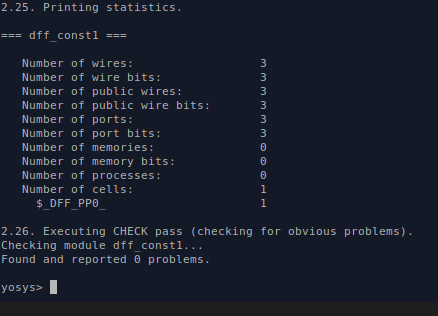

The stats confirm the flop was kept: `$_DFF_PP0_: 1` under the cell count. The `PP0` suffix tells me this is a positive-edge-triggered flip-flop with an active-high asynchronous reset (the `0` at the end indicates reset-to-0 polarity). Three wires listed: `clk`, `reset`, and `q`. No combinational cells — the entire design after synthesis is just this one flop.

**Schematic:**

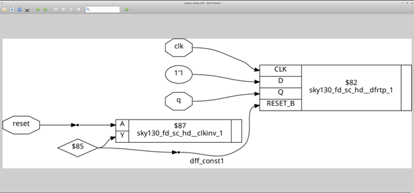

The schematic reveals the full mapped implementation. The main cell is `sky130_fd_sc_hd__dfrtp_1` — this is a D flip-flop with active-low asynchronous reset (`dfrtp` = D Flip-flop with Reset, True output, Positive clock). I can trace each connection:

- `clk` connects directly to the `CLK` pin.
- The constant `1'1` connects to the `D` pin — because the RTL always assigns `q <= 1` on the non-reset path, the D input is just permanently 1.
- `reset` goes through a `sky130_fd_sc_hd__clkinv_1` inverter before reaching the `RESET_B` pin. This is because the RTL uses active-high reset but the SKY130 `dfrtp` cell has an active-low reset pin (`RESET_B`). The inverter bridges that polarity difference.
- `Q` drives the output `q`.

There is also a feedback path where `q` connects back to the `Q` pin region — this is the standard DFF feedback structure Yosys uses in the dot viewer representation. The flop correctly models the behavior: on reset high, Q goes to 0 (RESET_B is low via the inverter); on the next clock edge after reset, D=1 gets captured and Q goes to 1.

---

### Lab: dff_const2 — Flop Eliminated

**RTL:**
```verilog
always @(posedge clk, posedge reset)
  if (reset) q <= 1'b1;
  else       q <= 1'b1;
```

Both branches assign `q <= 1`. There is no condition under which `q` can ever be 0. It does not matter what `clk` does, or when `reset` asserts or deasserts — `q` is always 1. Yosys recognizes this and removes the flop entirely, replacing it with a constant driver.

**Waveform:**

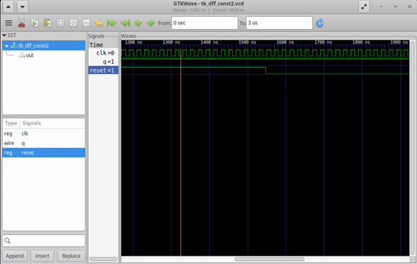

The waveform tells the whole story immediately. `q` is HIGH from the very first sample and never changes. I can see `reset` toggling, `clk` running normally, but `q` is completely flat at 1 throughout. There is no transition, no clock-edge behavior, nothing. The contrast with `dff_const1` is stark — in that design `q` had a visible transition at the clock edge after reset. Here there is nothing. The circuit has no dynamic behavior at the `q` output whatsoever.

**Synthesis stats:**

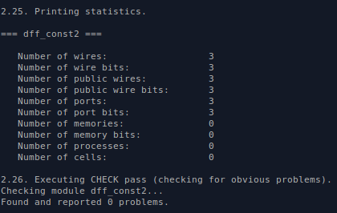

The stats show `Number of cells: 0`. This is the definitive confirmation. Yosys inferred no cells at all for this design. The wires are still listed (3 of them: `clk`, `reset`, `q`) because they exist as ports, but there is no gate, no flip-flop, no logic of any kind between input and output. The `dfflibmap` step had nothing to map because `synth` already eliminated the flop during constant propagation.

**Schematic:**

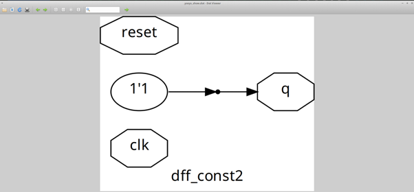

This schematic is one of the most instructive results of the entire workshop. The oval node `1'1` (a constant 1 source) connects directly to the octagon `q` (the output port) through a buffer. The `reset` port appears as a disconnected octagon at the top left — it is present in the port list because the RTL declared it, but it drives nothing in the netlist. The `clk` port also appears as a disconnected node at the bottom left for the same reason. Both are dead inputs. The entire circuit reduces to a wire from VCC to the output `q`. No flip-flop, no clock tree needed, nothing. In a real chip, this would mean one fewer flop in the design, one fewer clock net to route, and guaranteed-correct output with zero propagation delay.

---

### Lab: dff_const3 — Both Flops Retained

**RTL:**
```verilog
always @(posedge clk, posedge reset) begin
  if (reset) begin q1 <= 1'b0; q <= 1'b1; end
  else       begin q1 <= 1'b1; q  <= q1;  end
end
```

Two flops, and the second one (`q`) takes its input from the first one (`q1`). When reset deasserts, `q1` goes high on the next clock edge. But `q` can only capture `q1`'s new value on the clock edge *after* that. So for at least one full clock cycle, `q` is reading an old value of `q1`. Neither output is constant, and neither flop can be removed.

**Waveform:**

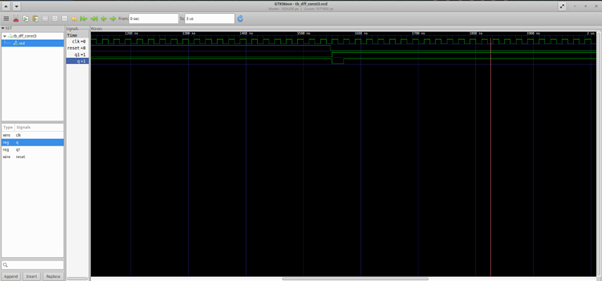

The waveform shows `reset` held high and then deasserted around the 1540 ns mark. After reset goes low, `q` remains high briefly then goes low, then comes back high — this is the two-flop interaction playing out in real time. The `q1` signal is not shown in this capture (it will be added in the manual realization update), but the behavior of `q` already reveals the chained dependency: `q` cannot track a stable value until both flops have cycled through their transitions. The one-cycle lag between `q1` and `q` is the key observation that proves both flops must be retained.

> **Note:** `q1` signal will be added to this waveform during the manual realization update.

**Synthesis stats:**

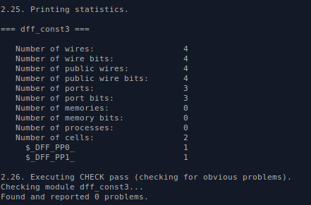

Two cells are reported: `$_DFF_PP0_: 1` and `$_DFF_PP1_: 1`. The difference in suffix (`PP0` vs `PP1`) is important. `PP0` means positive-edge-triggered, active-high reset, resets to 0. `PP1` means positive-edge-triggered, active-high set, resets to 1. This directly maps to the RTL: `q1` resets to 0 (uses `PP0`) and `q` resets to 1 (uses `PP1`). Four wires: `clk`, `reset`, `q1`, and `q`. Both flops are fully retained with their correct polarities.

**Schematic:**

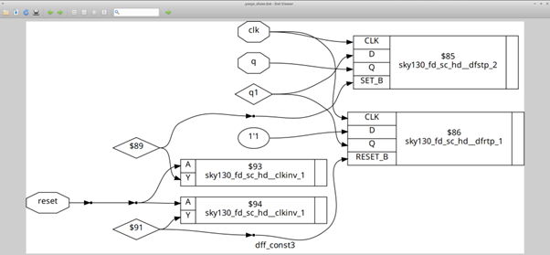

The schematic shows two distinct flip-flop cells. The upper cell is `sky130_fd_sc_hd__dfstp_2` — a D flip-flop with active-low SET (`dfstp` = D Flip-flop with Set, True output, Positive clock, drive strength 2). This maps to `q`, which resets to 1 in the RTL. Its `SET_B` pin is driven by `reset` through an inverter path. The lower cell is `sky130_fd_sc_hd__dfrtp_1` — a D flip-flop with active-low RESET. This maps to `q1`, which resets to 0. Its `RESET_B` pin is driven by `reset` through a separate `clkinv_1` inverter. The internal wire `q1` (shown as a diamond node) connects the `Q` output of the lower flop to the `D` input of the upper flop — this is the chained dependency that prevents either flop from being optimized away. Both `clk` connections run to the respective `CLK` pins. The constant `1'1` connects to the `D` pin of the lower flop because `q1` always clocks to 1.

---

### Lab Assignment: dff_const4 — Both Flops Eliminated

**RTL:** Both `q1` and `q` are assigned 1 in both the reset branch and the clock branch.

Both outputs are permanently 1 under all conditions. Yosys eliminates both flops.

**Synthesis stats:**

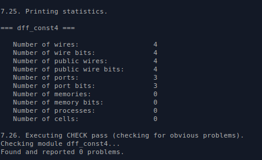

`Number of cells: 0`. Both flops gone. The logic is identical to `dff_const2` but applied to two outputs simultaneously. Four wires listed (ports `clk`, `reset`, `q1`, `q`) but none of them connect to any logic.

**Schematic:**

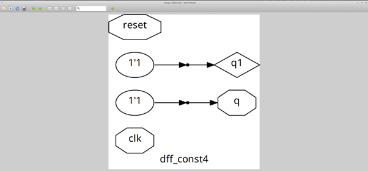

Two separate `1'1` constant sources, each driving one output directly. `q1` gets its constant 1 from the upper oval, `q` gets its constant 1 from the lower oval. `clk` and `reset` are isolated unconnected nodes at the sides. This is the multi-output equivalent of the `dff_const2` result — every dynamic element has been proved unnecessary and removed. In a physical implementation, both outputs would be tied to the power rail.

---

### Lab Assignment: dff_const5 — Both Flops Retained

**RTL:** `q1` resets to 0 and clocks to 1. `q` resets to 0 and clocks to `q1`.

`q1` is not constant (same argument as `dff_const1` — it transitions at the clock edge). Since `q1` is not constant, `q` which depends on `q1` is also not constant. Both flops stay.

**Synthesis stats:**

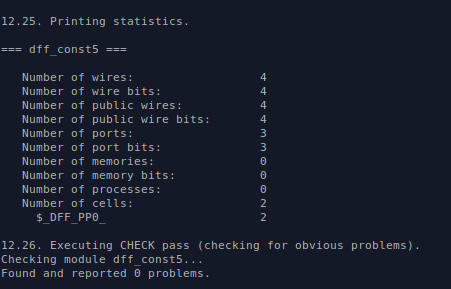

Two cells reported: `$_DFF_PP0_: 2`. Both are positive-edge, active-high reset, reset-to-0 type — because both `q1` and `q` reset to 0 in the RTL. Unlike `dff_const3` where the two flops had opposite reset polarities, here they are the same type, so the same `PP0` primitive is used twice.

**Schematic:**

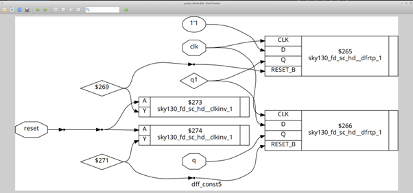

Two `sky130_fd_sc_hd__dfrtp_1` cells in a chain. The upper flop has `1'1` on its `D` pin (because `q1` always clocks to 1), and its `Q` output feeds the internal wire `q1`. That `q1` wire connects to the `D` pin of the lower flop, whose `Q` drives the output `q`. Both `RESET_B` pins are driven by `reset` through separate `clkinv_1` inverters. Both `CLK` pins receive the same `clk` signal. The structure is a two-stage pipeline: on the first clock edge after reset, `q1` goes high; on the second clock edge, `q` captures `q1` and goes high. The chained dependency means the optimizer cannot remove either stage.

**Pattern across all dff_const designs:**

| Design | Reset value | Clock-edge value | Constant? | Flops kept |
|--------|-------------|------------------|-----------|------------|
| dff_const1 | 0 | 1 | No — transitions on clock edge | 1 |
| dff_const2 | 1 | 1 | Yes — always 1 | 0 |
| dff_const3 | q1=0, q=1 | q1=1, q=q1 | No — clock dependency | 2 |
| dff_const4 | q1=1, q=1 | q1=1, q=1 | Yes — both always 1 | 0 |
| dff_const5 | q1=0, q=0 | q1=1, q=q1 | No — clock dependency | 2 |

The deciding factor is never just the reset value. It is whether the output can change after reset deasserts. If it can, the flop stays.

---

## Section C — Unused Output Optimization

If a module has internal signals that never reach any output port, the logic computing those signals is useless from the synthesis perspective. Yosys traces which internal signals actually feed the output and removes everything else. For a counter, this means if only one bit of a multi-bit count register is used at the output, only one flip-flop survives.

```bash
# Counter synthesis flow
yosys
read_liberty -lib ../lib/sky130_fd_sc_hd__tt_025C_1v80.lib
read_verilog counter_opt.v
synth -top counter_opt
dfflibmap -liberty ../lib/sky130_fd_sc_hd__tt_025C_1v80.lib
abc -liberty ../lib/sky130_fd_sc_hd__tt_025C_1v80.lib
show
```

---

### Lab: counter_opt — 1-Bit Counter Reduction

**RTL:**
```verilog
reg [2:0] count;
assign q = count[0];
always @(posedge clk)
  if (reset) count <= 3'b000;
  else       count <= count + 1;
```

The counter is 3 bits wide. It increments on every clock cycle. But the output `q` only reads `count[0]` — the least significant bit. Bits `count[1]` and `count[2]` never appear anywhere in the output path. Yosys asks: what does `count[0]` actually do? It toggles on every clock cycle — 0, 1, 0, 1, 0, 1... This is simply a toggle flip-flop. No 3-bit adder, no carry logic, no second or third flop needed.

**Synthesis stats:**

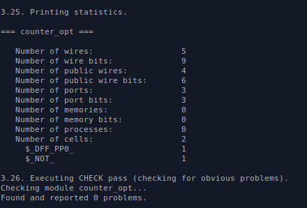

The stats show 2 cells total: `$_DFF_PP0_: 1` and `$_NOT_: 1`. Only one flip-flop for a 3-bit counter — this is the optimization working exactly as intended. The `$_NOT_` is the toggle feedback: to make `count[0]` toggle, Yosys simply inverts its own output and feeds it back to D. Five wires and 9 wire-bits are listed, which includes the bus representation, but the cell count is the important number. Bits `count[1]` and `count[2]` left no trace in the synthesized netlist.

**Schematic:**

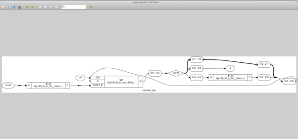

The schematic shows one `sky130_fd_sc_hd__dfrtp_1` flip-flop with a `sky130_fd_sc_hd__clkinv_1` inverter feeding back from `Q` to `D`. The `reset` input passes through another `clkinv_1` to reach the active-low `RESET_B` pin. `clk` connects to `CLK`. The `Q` output drives `count[0:0]` which feeds both the inverter (for toggle feedback) and the output `q`. The entire 3-bit incrementing counter has been reduced to this single toggle flop. The carry chain, the two upper flops, and all associated routing from the RTL simply do not exist in the netlist.

---

### Lab: counter_opt2 — Full 3-Bit Counter

Now the output assignment changes to read all three bits:

```verilog
assign q = (count == 3'b100);
```

The comparison `count == 3'b100` depends on all three bits of `count`. Yosys can no longer eliminate any bit — it needs all three flops to compute the output correctly.

```bash
# counter_opt2.v — modify the output assignment
# Check if counter_opt2.v exists first:
ls counter_opt2.v

# If not present, create it:
sed 's/assign q = count\[0\]/assign q = (count == 3'"'"'b100)/' counter_opt.v > counter_opt2.v

yosys
read_liberty -lib ../lib/sky130_fd_sc_hd__tt_025C_1v80.lib
read_verilog counter_opt2.v
synth -top counter_opt
dfflibmap -liberty ../lib/sky130_fd_sc_hd__tt_025C_1v80.lib
abc -liberty ../lib/sky130_fd_sc_hd__tt_025C_1v80.lib
show
```

**Synthesis stats:**

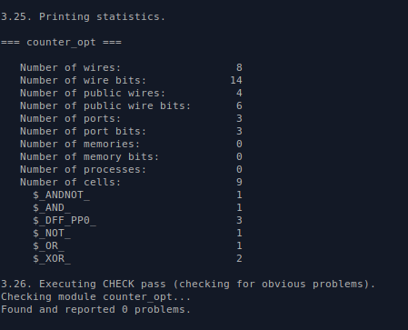

The cell count jumps to 9: `$_ANDNOT_: 1`, `$_AND_: 1`, `$_DFF_PP0_: 3`, `$_NOT_: 1`, `$_OR_: 1`, `$_XOR_: 2`. Three flip-flops are now present, one for each bit of the count register. The remaining 6 cells are the combinational logic for two things: the 3-bit incrementer (the `count + 1` adder logic) and the equality comparator (`count == 3'b100`). The XOR cells are part of the adder carry chain, the AND and OR cells handle carry propagation, and the ANDNOT handles the comparison. This is what a real 3-bit counter looks like synthesized — considerably more hardware than the 1-flop version.

**Schematic:**

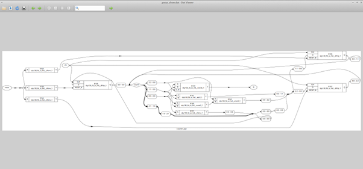

The schematic is substantially more complex. Three `dfrtp_1` flop cells are visible on the right side, each carrying one bit of `count`. Their `Q` outputs feed into the combinational logic in the middle: `sky130_fd_sc_hd__nor3b_1`, `sky130_fd_sc_hd__xor2_1`, `sky130_fd_sc_hd__xnor2_1`, `sky130_fd_sc_hd__nand2_1`, and `sky130_fd_sc_hd__clkinv_1`. The `D` inputs of the flops are driven by the adder outputs feeding back from this combinational block. The `reset` path on the far left drives all three `RESET_B` pins through a set of inverters. The output `q` comes from the comparator output at the far right. Every bit of `count` is active and contributes to the result — none of them can be trimmed.

**The core comparison:**

| Version | Output reads | DFFs synthesized | Total cells | What changed |
|---------|-------------|------------------|-------------|-------------|
| counter_opt | `count[0]` only | 1 | 2 | 2 bits unused, removed |
| counter_opt2 | `count == 3'b100` | 3 | 9 | All bits needed, all kept |

Same underlying RTL structure. One line of output assignment changed. The result is 1 flop versus 3 flops and 2 cells versus 9 cells. This is the practical impact of unused output optimization — writing RTL that exposes only the outputs you actually need allows the synthesizer to build a significantly smaller circuit.

---

## Summary Table

| Design | Type | Optimization applied | Cells synthesized |
|--------|------|---------------------|-------------------|
| opt_check | Combinational | Mux + constant 0 → AND | 1 (`and2`) |
| opt_check2 | Combinational | Mux + constant 1 → OR | 1 (`or2`) |
| opt_check3 | Combinational | Nested mux + constants → AND3 | 1 (`and3`) |
| opt_check4 | Combinational | Nested mux, redundant input → XNOR | 1 (`xnor2`) |
| multiple_module_opt | Combinational | Flatten required for cross-boundary opt | 2 (`a21o` + `and2`) |
| dff_const1 | Sequential | Clock dependency — flop retained | 1 DFF |
| dff_const2 | Sequential | Always 1 — flop eliminated | 0 |
| dff_const3 | Sequential | Chained dependency — both flops retained | 2 DFFs |
| dff_const4 | Sequential | Both always 1 — both flops eliminated | 0 |
| dff_const5 | Sequential | Chained dependency — both flops retained | 2 DFFs |
| counter_opt | Unused output | Only bit[0] used — 2 bits trimmed | 1 DFF + 1 NOT |
| counter_opt2 | Unused output | All bits used — full counter retained | 3 DFFs + 6 comb |

---

## Back to Main Repo

[← RTL Design Workshop — Main README](https://github.com/Saicharan-malyala/RTL-Design-Workshop)
