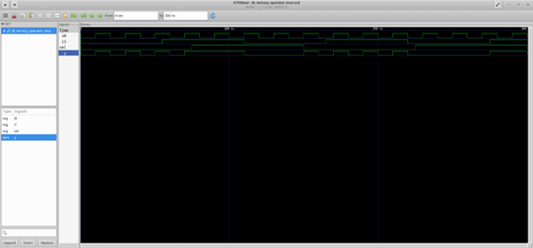
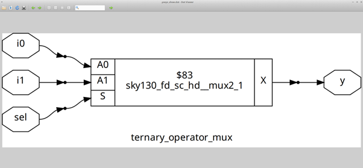
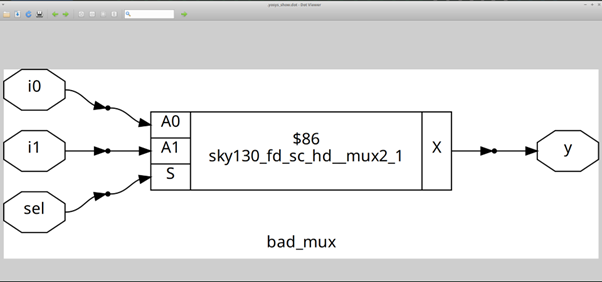
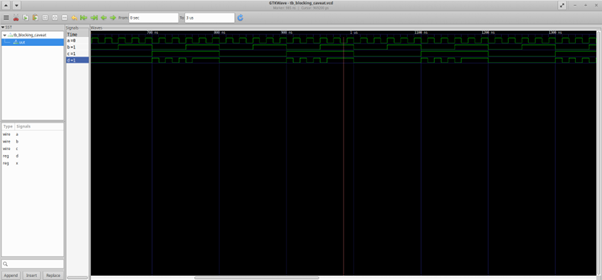
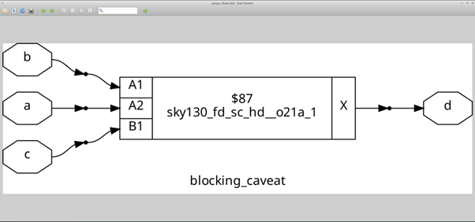

# ⚡ Day 4 — Gate-Level Simulation & Synthesis-Simulation Mismatch

[](https://github.com/steveicarus/iverilog)
[](http://gtkwave.sourceforge.net/)
[](https://yosyshq.net/yosys/)
[](https://github.com/google/skywater-pdk)
[](https://en.wikipedia.org/wiki/Verilog)
[](https://ubuntu.com/)

**Three labs. One goal: understand when your RTL sim lies to you.**  
Day 4 is entirely about GLS  simulating the synthesized netlist and catching the two most common ways RTL simulation diverges from actual hardware behavior.

> *(Refer [Day_1](../Day_1/README.md) for iverilog/GTKWave setup and basic simulation flow.)*

---

## 📌 Table of Contents

- [🧠 What is GLS?](#-what-is-gls)
- [🧠 Simulation-Synthesis Mismatch — The Two Root Causes](#-simulation-synthesis-mismatch--the-two-root-causes)
- [🔬 Lab 1 — ternary\_operator\_mux (GLS Baseline, No Mismatch)](#-lab-1--ternary_operator_mux-gls-baseline-no-mismatch)
- [🔴 Lab 2 — bad\_mux (Mismatch: Incomplete Sensitivity List)](#-lab-2--bad_mux-mismatch-incomplete-sensitivity-list)
- [🔴 Lab 3 — blocking\_caveat (Mismatch: Blocking Assignment Ordering)](#-lab-3--blocking_caveat-mismatch-blocking-assignment-ordering)
- [✅ Day 4 Summary](#-day-4-summary)

---

## 🧠 What is GLS?

GLS stands for **Gate-Level Simulation**. Instead of simulating the RTL source, you simulate the synthesized netlist the actual gate-level representation produced by Yosys using the same testbench.

**Why bother?** Synthesis is not a lossless translation. The synthesizer makes decisions about how to interpret your RTL, and sometimes those decisions don't match what the simulator did. GLS catches those mismatches before you tape out.

**How it works:** iverilog is given three files together the SKY130 cell primitives (`primitives.v`), the full SKY130 standard cell model (`sky130_fd_sc_hd.v`), and the gate-level netlist alongside the same testbench used for RTL sim. The netlist now runs through actual cell models instead of abstract behavioral descriptions.

```bash
iverilog ../my_lib/verilog_model/primitives.v \
         ../my_lib/verilog_model/sky130_fd_sc_hd.v \
         <design>_net.v tb_<design>.v
./a.out
gtkwave tb_<design>.vcd
```

If the GLS waveform matches the RTL waveform great, your RTL faithfully described the hardware. If they differ you have a **simulation-synthesis mismatch**, and the netlist (not the RTL sim) reflects what silicon will actually do.

---

## 🧠 Simulation-Synthesis Mismatch — The Two Root Causes

Day 4 covers the two most common causes:

**1. Incomplete sensitivity list**

In Verilog, `always @(sel)` means the simulator only re-evaluates that block when `sel` changes. If `i0` or `i1` change while `sel` is static, the block never fires, so the output freezes even though the logic inside clearly depends on those signals. The synthesizer completely ignores the sensitivity list. It reads the body of the `always` block and infers the correct combinational function regardless. Result: RTL sim shows broken behavior, GLS shows correct behavior.

**2. Blocking assignments in always blocks**

Blocking (`=`) assignments execute sequentially in simulation. If you write:
```verilog
x = a | b;
d = x & c;
```
this works fine — `x` is updated before `d` uses it. But if the order is reversed:
```verilog
d = x & c;   // x still holds old value here
x = a | b;
```
`d` sees the *previous* value of `x`, effectively creating an unintended register on `x`. The synthesizer infers the actual logic intent from the expressions, not the evaluation order so it may produce different (and correct) hardware. Again: RTL sim and GLS diverge.

---

## 🔬 Lab 1 — ternary\_operator\_mux (GLS Baseline, No Mismatch)

This lab runs GLS on a clean, correct design first. It establishes that our GLS setup works before we move on to the broken designs.

**The design** uses a ternary operator to implement a 2:1 mux:
```verilog
assign y = sel ? i1 : i0;
```

### RTL Simulation

```bash
cd ~/Desktop/vlsi/sky130RTLDesignAndSynthesisWorkshop/verilog_files
iverilog ternary_operator_mux.v tb_ternary_operator_mux.v
./a.out
gtkwave tb_ternary_operator_mux.vcd
```



The waveform shows `i0`, `i1`, `sel`, and `y`. Behavior is exactly what a mux should do: when `sel=0`, `y` mirrors `i0` perfectly — every toggle in `i0` shows up immediately in `y`. When `sel` goes high around 130 ns, `y` switches to tracking `i1` instead. No glitches, no lag, no freezing. This is the reference.

### Synthesis

```bash
yosys
read_liberty -lib ../lib/sky130_fd_sc_hd__tt_025C_1v80.lib
read_verilog ternary_operator_mux.v
synth -top ternary_operator_mux
abc -liberty ../lib/sky130_fd_sc_hd__tt_025C_1v80.lib
write_verilog -noattr ternary_operator_mux_net.v
show
```



Yosys mapped the ternary operator directly to a single `sky130_fd_sc_hd__mux2_1` cell ($83 in the schematic). The connections are clean: `i0` goes to `A0`, `i1` to `A1`, `sel` to `S`, and the cell output `X` drives `y`. One cell, zero ambiguity. The synthesizer understood the intent perfectly.

### GLS

```bash
iverilog ../my_lib/verilog_model/primitives.v \
         ../my_lib/verilog_model/sky130_fd_sc_hd.v \
         ternary_operator_mux_net.v tb_ternary_operator_mux.v
./a.out
gtkwave tb_ternary_operator_mux.vcd
```


**Comparison with RTL sim:** Identical. The GLS waveform has the same SST hierarchy depth as before (sub-instances `_6_`, `_7_`, `_8_` appear — those are the internal transistors of the SKY130 mux cell being simulated), but the output `y` behaves exactly the same: tracks `i0` when `sel=0`, tracks `i1` when `sel=1`. **No mismatch.** This is the expected outcome for correctly written RTL. The ternary operator with no sensitivity list issues maps to hardware without surprises.

---

## 🔴 Lab 2 — bad\_mux (Mismatch: Incomplete Sensitivity List)

The RTL for `bad_mux` has a classic mistake the `always` block only lists `sel` in its sensitivity list, missing `i0` and `i1`:

```verilog
always @(sel)          // BUG: should be always @(*)
  if (sel) y = i1;
  else     y = i0;
```

### RTL Simulation

```bash
iverilog bad_mux.v tb_bad_mux.v
./a.out
gtkwave tb_bad_mux.vcd
```


Look at the region from 0 to ~100 ns where `sel=0`. During that window, `i0` is toggling multiple times but `y` is completely flat. It doesn't respond at all to `i0` changes. The same thing happens from ~100 ns to ~200 ns where `sel=1` and `i1` is actively changing but `y` just holds whatever value it had when `sel` last transitioned. The `always` block only fires on `sel` edges, so in between those edges the output is frozen. This is latching-like behavior but it's not a real latch, it's just a simulator following a bad sensitivity list literally. The design is acting like a sample-and-hold, not a mux.

### Synthesis

```bash
yosys
read_liberty -lib ../lib/sky130_fd_sc_hd__tt_025C_1v80.lib
read_verilog bad_mux.v
synth -top bad_mux
abc -liberty ../lib/sky130_fd_sc_hd__tt_025C_1v80.lib
write_verilog -noattr bad_mux_net.v
show
```



Yosys synthesized a correct `sky130_fd_sc_hd__mux2_1` cell ($86) the same standard mux cell as the ternary design. The connections are identical: `i0→A0`, `i1→A1`, `sel→S`. Yosys may warn about the sensitivity list during elaboration, but it doesn't honor it. The synthesizer reads the body of the always block and infers a 2:1 mux from the if-else, full stop. The netlist is perfectly correct even though the RTL was broken.

### GLS

```bash
iverilog ../my_lib/verilog_model/primitives.v \
         ../my_lib/verilog_model/sky130_fd_sc_hd.v \
         bad_mux_net.v tb_bad_mux.v
./a.out
gtkwave tb_bad_mux.vcd
```


**Comparison with RTL sim — this is the mismatch.** In the RTL sim waveform, `y` was frozen whenever `sel` wasn't changing. In this GLS waveform, `y` responds immediately to every `i0` and `i1` toggle regardless of whether `sel` is moving. With `sel=0`, `y` perfectly tracks `i0` every pulse in `i0` appears in `y`. With `sel=1` (around the 100–200 ns region), `y` mirrors `i1` directly.

The GLS behavior is correct. The RTL sim behavior was wrong. The **netlist is fine — the RTL code was the bug**. GLS caught this. If you had taped out based on RTL sim confidence, you would have expected latch-like behavior on chip, but the silicon would act as a proper mux.

---

## 🔴 Lab 3 — blocking\_caveat (Mismatch: Blocking Assignment Ordering)

The RTL uses blocking assignments in the wrong order inside a combinational `always` block:

```verilog
always @(*) begin
  d = x & c;   // d uses x BEFORE x is updated in this block
  x = a | b;
end
```

In simulation, `d = x & c` executes first using the **previous** value of `x` from the last simulation cycle not the freshly computed `a | b`. So `d` effectively sees a one-cycle-old `x`, behaving as if there's a flip-flop on `x` that the designer never intended.

### RTL Simulation

```bash
iverilog blocking_caveat.v tb_blocking_caveat.v
./a.out
gtkwave tb_blocking_caveat.vcd
```



The signals shown are `a`, `b`, `c`, and `d` (with `x` as an internal register visible in the signal panel). Watch the output `d` relative to the inputs. There are moments where `a` and `b` change meaning `x = a | b` should update but `d` still shows the old value for that cycle because it was computed using the pre-update `x`. The output is correct one clock edge late. This is the "phantom flip-flop" effect from blocking statement ordering. Interestingly, the waveform title still says `tb_blocking_caveat.vcd` and signals are typed as `reg` confirming this is the pure RTL sim without any cell instances.

### Synthesis

```bash
yosys
read_liberty -lib ../lib/sky130_fd_sc_hd__tt_025C_1v80.lib
read_verilog blocking_caveat.v
synth -top blocking_caveat
abc -liberty ../lib/sky130_fd_sc_hd__tt_025C_1v80.lib
write_verilog -noattr blocking_caveat_net.v
show
```



Yosys synthesized a **`sky130_fd_sc_hd__o21a_1`** cell ($87) — this is an OR-AND-21 gate. Looking at the connections: `b→A1`, `a→A2`, `c→B1`, output `X→d`. The `o21a` function is `(A1 OR A2) AND B1`, which translates to `(b | a) & c` exactly `(a | b) & c`, the correct combinational logic for this design. No flip-flop anywhere in the schematic. **The synthesizer correctly determined that the intended logic is purely combinational**, regardless of the blocking assignment ordering in the source.

### GLS

```bash
iverilog ../my_lib/verilog_model/primitives.v \
         ../my_lib/verilog_model/sky130_fd_sc_hd.v \
         blocking_caveat_net.v tb_blocking_caveat.v
./a.out
gtkwave tb_blocking_caveat.vcd
```


**Comparison with RTL sim — the mismatch is clear.** In the RTL sim, `d` was lagging by one evaluation step because it read stale `x`. In this GLS waveform, `a`, `b`, `c`, and `d` are all present (no `x` the intermediate has been absorbed into the `o21a_1` cell), and `d` updates immediately and correctly as `(a | b) & c` with no lag. The signals are now `wire` type instead of `reg`, which is consistent with purely combinational gate-level simulation.

The mismatch: RTL sim made `d` behave like it depended on a registered version of `x`. GLS shows the correct immediate combinational response. The synthesizer was right. Your RTL was misleading.

**Takeaway:** Never use blocking assignments when there's any risk of ordering dependencies between intermediate variables in the same always block. Use `always @(*)` with non-blocking (`<=`) for registered logic. For purely combinational logic in always blocks, either use `always @(*)` with blocking assignments in the correct evaluation order, or better yet, use `assign` statements where evaluation order is not an issue.

---

## ✅ Day 4 Summary

| Lab | Design | Root Cause | RTL Sim Behavior | GLS Behavior | Mismatch? |
|-----|--------|------------|-----------------|--------------|-----------|
| 1 | `ternary_operator_mux` | None — correct RTL | Correct 2:1 mux | Matches RTL sim exactly | ❌ No |
| 2 | `bad_mux` | Incomplete sensitivity list (`@(sel)`) | Output freezes when sel is static | Correct mux — y follows inputs | ✅ Yes |
| 3 | `blocking_caveat` | Blocking `=` in wrong order | Stale x — d lags by one eval | Correct combinational `(a\|b)&c` | ✅ Yes |

The pattern across all three labs: the synthesizer is always right about the intended hardware. RTL simulation can be wrong for two reasons incomplete sensitivity lists and blocking assignment ordering. GLS is the safety net that catches both.

---

*[← Back to Workshop Repo](https://github.com/Saicharan-malyala/RTL-Design-Workshop)*