# Day 5 — If-Else Hazards, Case Hazards & Looping Constructs 🔁


> *(Refer Day-1 for simulation flow basics — iverilog, GTKWave, and Yosys command fundamentals.)*

---

## 📑 Table of Contents

1. [🧠 If-Else Hazards](#-if-else-hazards)
   - [incomp_if.v](#1-incomp_ifv)
   - [incomp_if2.v](#2-incomp_if2v)
2. [🔬 Case Hazards](#-case-hazards)
   - [incomp_case.v](#1-incomp_casev)
   - [comp_case.v](#2-comp_casev)
   - [partial_case_assign.v](#3-partial_case_assignv)
   - [bad_case.v + GLS](#4-bad_casev--gls)
3. [🔁 Looping Constructs](#-looping-constructs)
   - [mux_generate.v](#1-mux_generatev)
   - [demux_case.v](#2-demux_casev)
   - [demux_generate.v + GLS](#3-demux_generatev--gls)
   - [fa.v + rca.v + GLS](#4-fav--rcav--gls)
4. [📊 Summary Table](#-summary-table)
5. [🔗 Back to Main Repo](#-back-to-main-repo)

---

## 🧠 If-Else Hazards

When `if` statements are written without a complete `else` branch, the synthesis tool has no instruction for what the output should be in the uncovered condition. Its natural response is to **infer a latch** — it assumes the output must *hold its previous value*. This is a dangerous coding hazard because a latch is a sequential element, and its inference in a purely combinational block leads to simulation vs. synthesis mismatches and unexpected timing behavior.

The golden rule: **always cover every branch of an `if` statement.**

---

### 1. `incomp_if.v`

```verilog
module incomp_if (input i0 , input i1 , input i2 , output reg y);
always @ (*)
begin
	if(i0)
		y <= i1;
end
endmodule
```

There is no `else` clause here. When `i0 = 0`, the output `y` has no defined assignment — so the synthesizer infers a latch to retain the last known value of `y`.

**Simulation:**

```bash
iverilog incomp_if.v tb_incomp_if.v
./a.out
gtkwave tb_incomp_if.vcd
```

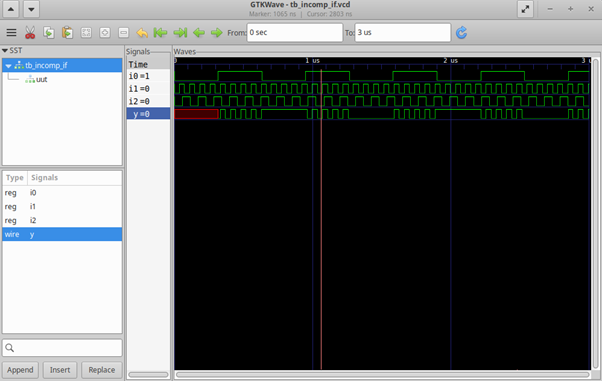

Looking at the waveform, whenever `i0` is HIGH, `y` faithfully follows `i1` — this is the expected mux-select behavior. But the moment `i0` goes LOW, `y` does not reset or respond to any input. It freezes at whatever value it last held. That flat, non-responsive region is the giveaway — `y` is latching state rather than being driven combinationally. The output is completely ignoring `i2`, which confirms there is no logic path for the `else` condition anywhere in the circuit.

**Synthesis:**

```bash
yosys
read_liberty -lib ../lib/sky130_fd_sc_hd__tt_025C_1v80.lib
read_verilog incomp_if.v
synth -top incomp_if
abc -liberty ../lib/sky130_fd_sc_hd__tt_025C_1v80.lib
show
```

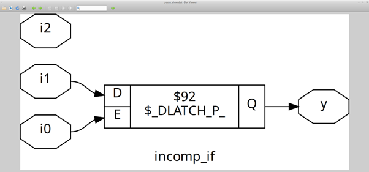

The schematic confirms exactly what the waveform suggested — Yosys has inferred a **D-latch** from what was written as a combinational `always` block. The `i0` signal drives the enable pin of the latch. When `i0` is HIGH the latch is transparent and passes `i1` through to `y`. When `i0` is LOW the latch closes and holds the output. This is not a flip-flop controlled by a clock — it is a level-sensitive latch, and its presence inside a combinational design is a hazard that will cause unpredictable behavior in silicon.

---

### 2. `incomp_if2.v`

```verilog
module incomp_if2 (input i0 , input i1 , input i2 , input i3, output reg y);
always @ (*)
begin
	if(i0)
		y <= i1;
	else if (i2)
		y <= i3;
end
endmodule
```

Two branches are present (`if` and `else if`), but there is no final `else`. When both `i0 = 0` and `i2 = 0`, no branch is taken and the output has no defined value — another latch gets inferred.

**Simulation:**

```bash
iverilog incomp_if2.v tb_incomp_if2.v
./a.out
gtkwave tb_incomp_if2.vcd
```

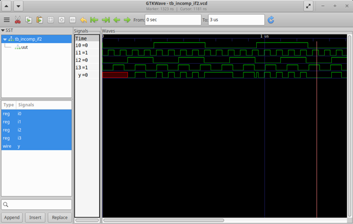

The waveform shows a more nuanced version of the same problem. When `i0` is HIGH, `y` tracks `i1`. When `i0` is LOW and `i2` is HIGH, `y` switches to tracking `i3` — both defined branches are working correctly. But when both `i0` and `i2` are simultaneously LOW, `y` stops changing entirely and holds its last value. That frozen region in the waveform marks the latch holding state. A correct combinational block would drive a defined value in this condition, but here there is no path at all — the `else if` chain runs out and the output goes undefined.

**Synthesis:**

```bash
yosys
read_liberty -lib ../lib/sky130_fd_sc_hd__tt_025C_1v80.lib
read_verilog incomp_if2.v
synth -top incomp_if2
abc -liberty ../lib/sky130_fd_sc_hd__tt_025C_1v80.lib
show
```

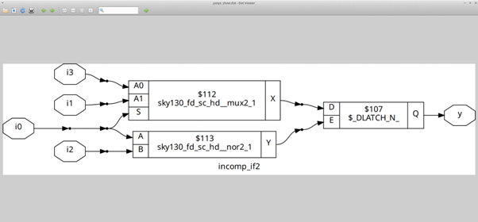

The schematic again shows a D-latch inferred at the output. The enable logic feeding the latch is now built from both `i0` and `i2` — the latch engages specifically when neither condition is met, i.e., `i0 = 0` and `i2 = 0`. The two covered paths feed through combinational mux logic directly into the latch input, but the latch itself sits at the output to cover the undefined state. This proves that having multiple branches with `else if` is not a safeguard — what matters is whether every possible input combination has a defined output assignment. A trailing `else` is mandatory.

---

## 🔬 Case Hazards

Case statements carry the same dangers as incomplete `if` chains. An **incomplete case** (missing some select values without a `default`) causes latch inference for those gaps. A **partial case** (where some outputs are not driven in all branches) infers latches only on the undriven outputs. The `bad_case` scenario introduces an overlapping wildcard pattern (`2'b1?`) which the simulator and synthesizer interpret differently — producing an RTL vs. GLS mismatch.

---

### 1. `incomp_case.v`

Cases `2'b10` and `2'b11` are not covered and there is no `default`. The tool infers a latch for those uncovered states.

**Simulation:**

```bash
iverilog incomp_case.v tb_incomp_case.v
./a.out
gtkwave tb_incomp_case.vcd
```

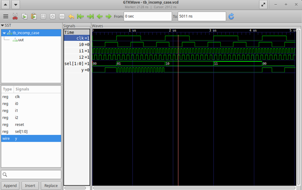

From the waveform, `y` correctly follows `i0` when `sel = 2'b00` and follows `i1` when `sel = 2'b01` — both defined cases behave exactly as expected. However, as soon as `sel` transitions to `2'b10` or `2'b11`, `y` stops responding. It simply holds the last value it carried when the case was last matched. This is visually identical to the `incomp_if` hazard — the same flat, stale output — just triggered by a select encoding rather than a missing `else`. The undriven states make `y` a latch rather than a combinational output.

**Synthesis:**

```bash
yosys
read_liberty -lib ../lib/sky130_fd_sc_hd__tt_025C_1v80.lib
read_verilog incomp_case.v
synth -top incomp_case
abc -liberty ../lib/sky130_fd_sc_hd__tt_025C_1v80.lib
show
```

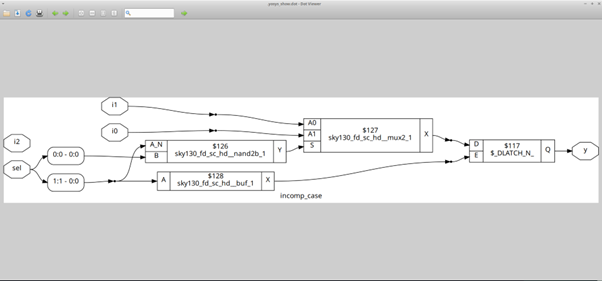

The schematic shows a latch in the design. The enable logic feeding the latch is derived from `sel[1]` — it activates specifically for the uncovered states `2'b10` and `2'b11`, i.e., whenever `sel[1]` is HIGH. The two covered paths feed through combinational mux cells directly, but the latch sits at the output boundary to handle the undefined states. A `default` assignment of any value would have completely eliminated this latch, giving the synthesizer a complete truth table.

---

### 2. `comp_case.v`

Adding `default : y = i2` covers all remaining states (`2'b10`, `2'b11`), giving the synthesizer a complete truth table and eliminating latch inference entirely.

**Simulation:**

```bash
iverilog comp_case.v tb_comp_case.v
./a.out
gtkwave tb_comp_case.vcd
```

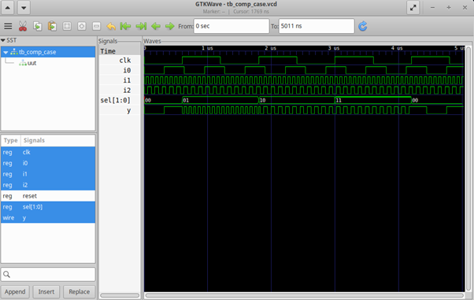

This waveform is the clean counterpart to `incomp_case`. `y` follows `i0` for `sel = 00`, `i1` for `sel = 01`, and `i2` for any other select value. Most importantly, `y` is always actively driven — there are no flat, non-responsive regions anywhere. Every transition in `sel` produces an immediate response in `y`, which is the expected behavior of a purely combinational multiplexer. The addition of a single `default` line in the source was all that was needed.

**Synthesis:**

```bash
yosys
read_liberty -lib ../lib/sky130_fd_sc_hd__tt_025C_1v80.lib
read_verilog comp_case.v
synth -top comp_case
abc -liberty ../lib/sky130_fd_sc_hd__tt_025C_1v80.lib
show
```

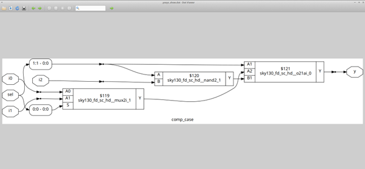

The schematic is entirely combinational — no latch present anywhere in the design. Yosys has mapped this to standard MUX cells from the sky130 library. The `default` clause gave the synthesizer a fully defined output for every possible `sel` value, so it had no reason to infer any memory element. This is the correct, hazard-free implementation and serves as the direct comparison baseline for `incomp_case`.

---

### 3. `partial_case_assign.v`

```verilog
module partial_case_assign (input i0 , input i1 , input i2 , input [1:0] sel, output reg y , output reg x);
always @ (*)
begin
	case(sel)
		2'b00 : begin
			y = i0;
			x = i2;
			end
		2'b01 : y = i1;
		default : begin
		           x = i1;
			   y = i2;
			  end
	endcase
end
endmodule
```

All values of `sel` are covered via `default`, so `y` receives a defined assignment in every branch. But in the `2'b01` branch, `x` is completely absent — so a latch is inferred for `x` only.

**Synthesis:**

```bash
yosys
read_liberty -lib ../lib/sky130_fd_sc_hd__tt_025C_1v80.lib
read_verilog partial_case_assign.v
synth -top partial_case_assign
abc -liberty ../lib/sky130_fd_sc_hd__tt_025C_1v80.lib
show
```

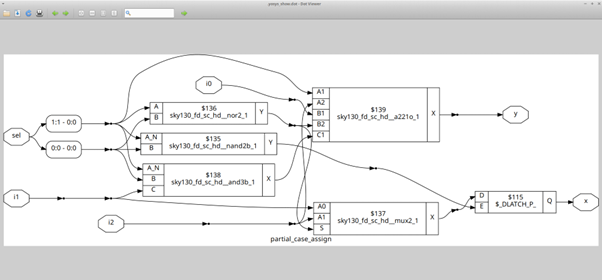

The schematic here is the most instructive one in this section — it shows exactly one latch, and it is specifically on output `x`. Output `y` synthesizes to clean combinational logic because it is assigned in every branch: `2'b00`, `2'b01`, and `default`. Output `x`, however, is only assigned in `2'b00` and `default` — the `2'b01` branch leaves `x` untouched, so the synthesizer infers a latch to hold its value when `sel = 2'b01`. This demonstrates that latch inference is per-output, not per-block. A single missing assignment in a single branch for a single output is enough to latch exactly that output, while everything else in the same block synthesizes cleanly.

---

### 4. `bad_case.v` + GLS

```verilog
module bad_case (input i0 , input i1, input i2, input i3 , input [1:0] sel, output reg y);
always @(*)
begin
	case(sel)
		2'b00: y = i0;
		2'b01: y = i1;
		2'b10: y = i2;
		2'b1?: y = i3;
	endcase
end
endmodule
```

The wildcard pattern `2'b1?` overlaps with both `2'b10` and `2'b11`. The RTL simulator evaluates cases top-down with priority — `2'b10` hits the explicit entry first, while `2'b11` falls through to the wildcard. The synthesizer, however, sees all four select combinations as covered and produces no latch — but it maps the wildcard without priority logic, leading to an **RTL vs. GLS mismatch**.

**Simulation:**

```bash
iverilog bad_case.v tb_bad_case.v
./a.out
gtkwave tb_bad_case.vcd
```

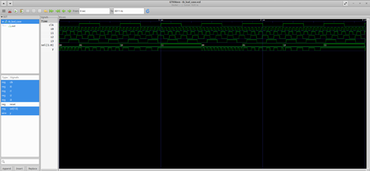

In the RTL simulation waveform, the behavior looks perfectly reasonable. `y` follows `i0` for `sel = 00`, `i1` for `sel = 01`, `i2` for `sel = 10`, and `i3` for `sel = 11`. The simulator honours the top-down priority of case entries and resolves the overlap cleanly, with `2'b10` matching its explicit entry before the wildcard gets a chance. There is no latch behavior and no obvious anomaly in this waveform — which is exactly what makes this hazard so dangerous. The RTL simulation passes, but the silicon will not behave the same way.

**Synthesis:**

```bash
yosys
read_liberty -lib ../lib/sky130_fd_sc_hd__tt_025C_1v80.lib
read_verilog bad_case.v
synth -top bad_case
abc -liberty ../lib/sky130_fd_sc_hd__tt_025C_1v80.lib
write_verilog -noattr bad_case_net.v
show
```

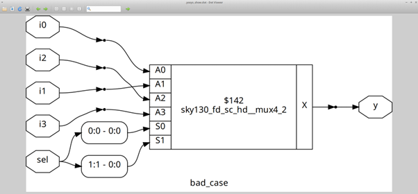

The synthesis schematic shows no latch — the synthesizer sees all four select values as covered and produces pure combinational logic. However, it has interpreted the wildcard `2'b1?` without any priority mechanism, since synthesis tools do not implement case-priority the way simulators do. The gate-level netlist therefore encodes different behavior for the overlapping `2'b10` case than the RTL simulator produced.

**Generated Netlist:**

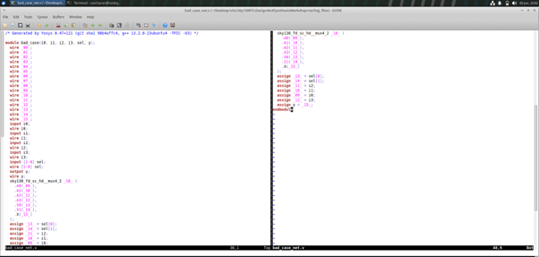

The netlist file shows the flattened gate-level implementation. The logic that was meant to distinguish `sel = 2'b10` (explicit) from `sel = 2'b11` (wildcard) is collapsed together in the gates — the synthesizer merged both into a single path driven by the wildcard, losing the priority resolution that the simulator applied.

**🔴 GLS Simulation (RTL vs. GLS Mismatch):**

```bash
iverilog ../my_lib/verilog_model/primitives.v ../my_lib/verilog_model/sky130_fd_sc_hd.v bad_case_net.v tb_bad_case.v
./a.out
gtkwave tb_bad_case.vcd
```

| RTL Simulation | GLS Simulation |
|:-:|:-:|
|  |  |

Placing both waveforms side by side makes the mismatch immediately visible. In the RTL simulation, `y = i2` when `sel = 2'b10`. In the GLS simulation, that same select condition now drives `y = i3` instead — because the wildcard absorbed both `2'b10` and `2'b11` during synthesis, collapsing them to a single gate-level path. The discrepancy confirms that the synthesized hardware does not faithfully reproduce the RTL simulator's priority-based interpretation. This is the classic case of why ambiguous or overlapping patterns in a case statement must never be used — the design simulates correctly at RTL but synthesizes to different logic, and the bug only surfaces during GLS.

---

## 🔁 Looping Constructs

As designs scale — a 1×8 demux, a 1×256 demux, or an 8-bit ripple carry adder — writing explicit case or if entries for every output becomes impractical. Verilog's `for` loop inside `always` blocks and `generate` loops allow compact, scalable, and readable code. The hardware inferred is identical to an equivalent explicit version; only the coding style changes.

---

### 1. `mux_generate.v`

```verilog
module mux_generate (input i0 , input i1, input i2 , input i3 , input [1:0] sel  , output reg y);
wire [3:0] i_int;
assign i_int = {i3,i2,i1,i0};
integer k;
always @ (*)
begin
for(k = 0; k < 4; k=k+1) begin
	if(k == sel)
		y = i_int[k];
end
end
endmodule
```

A 4:1 MUX written using a `for` loop — iterates through all indices and selects the input whose index matches `sel`. Functionally equivalent to a 4-entry case statement, but scales cleanly to any width by changing only the loop bound.

**Simulation:**

```bash
iverilog mux_generate.v tb_mux_generate.v
./a.out
gtkwave tb_mux_generate.vcd
```


The waveform confirms that the loop-based MUX behaves exactly as a traditional case-based MUX would. As `sel` steps through `00`, `01`, `10`, and `11`, output `y` correctly tracks `i0`, `i1`, `i2`, and `i3` respectively. Every transition in `sel` is followed immediately by the correct input on `y` with no latching, confirming purely combinational operation. The `for` loop unrolls completely at elaboration time and the synthesizer sees the same logic as a 4-entry case statement — the abstraction costs nothing in hardware.

---

### 2. `demux_case.v`

A 1×8 demux written with explicit case entries — all 8 outputs hand-coded. The bus `y_int` is first cleared to `8'b0`, then only the selected bit is driven to `i`. This zero-initialisation is what ensures all unselected outputs are actively driven LOW, avoiding any latch inference from undriven outputs.

**Simulation:**

```bash
iverilog demux_case.v tb_demux_case.v
./a.out
gtkwave tb_demux_case.vcd
```

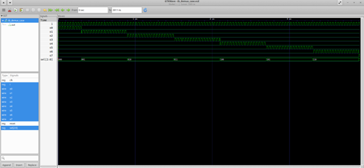

The waveform shows all eight output lines `o0` through `o7`. At any given moment, exactly one output is HIGH and tracks `i`, while all remaining outputs are driven LOW. As `sel` cycles through each binary value, the active channel shifts accordingly — `o0` for `sel = 000`, `o1` for `sel = 001`, and so on through `o7`. The clean zero state on all non-selected outputs is a direct result of the `y_int = 8'b0` default at the top of the always block, which guarantees that every output is driven in every simulation cycle regardless of which branch is taken.

**Synthesis:**

```bash
yosys
read_liberty -lib ../lib/sky130_fd_sc_hd__tt_025C_1v80.lib
read_verilog demux_case.v
synth -top demux_case
abc -liberty ../lib/sky130_fd_sc_hd__tt_025C_1v80.lib
show
```

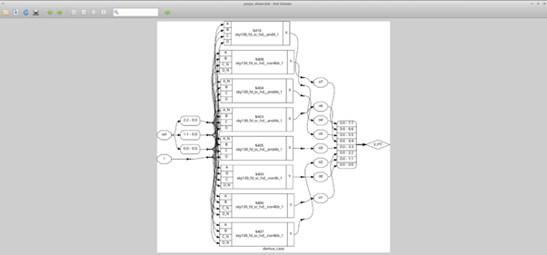

The synthesized schematic shows 8 output paths, each built as an AND gate combination of the select lines. Each output is essentially a minterm of the 3-bit `sel` bus gated with `i` — for example, `o3` is active only when `sel = 3'b011`, which is `sel[1] & ~sel[2] & sel[0]` gated with `i`. There are no latches anywhere in the schematic, confirming that the zero-initialisation strategy provided complete output coverage and the synthesizer had no reason to infer any memory elements.

---

### 3. `demux_generate.v` + GLS

```verilog
module demux_generate (output o0 , output o1, output o2 , output o3, output o4, output o5, output o6 , output o7 , input [2:0] sel  , input i);
reg [7:0]y_int;
assign {o7,o6,o5,o4,o3,o2,o1,o0} = y_int;
integer k;
always @ (*)
begin
y_int = 8'b0;
for(k = 0; k < 8; k++) begin
	if(k == sel)
		y_int[k] = i;
end
end
endmodule
```

The exact same 1×8 demux — just 3 lines of `for` loop instead of 8 case entries. To scale this to a 1×256 demux, only `k < 8` needs to change to `k < 256`. The case version would require 256 lines.

**Simulation:**

```bash
iverilog demux_generate.v tb_demux_generate.v
./a.out
gtkwave tb_demux_generate.vcd
```

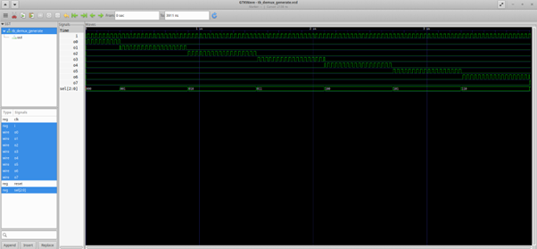

The waveform is identical to the `demux_case` simulation — exactly one output is active at a time, tracking `i` on the selected channel and held LOW on all others. This confirms that rewriting the demux as a `for` loop produces zero behavioural difference. The loop unrolls to the same combinational logic at elaboration, and the zero-initialisation at the start of the always block still guarantees full output coverage for every `sel` value.

**Synthesis:**

```bash
yosys
read_liberty -lib ../lib/sky130_fd_sc_hd__tt_025C_1v80.lib
read_verilog demux_generate.v
synth -top demux_generate
abc -liberty ../lib/sky130_fd_sc_hd__tt_025C_1v80.lib
write_verilog -noattr demux_generate_net.v
show
```

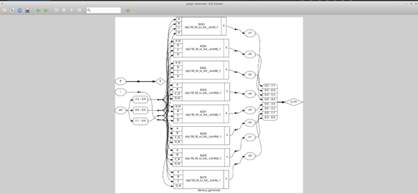

The synthesized schematic is structurally identical to the `demux_case` synthesis — the same 8 AND-gate minterms, the same symmetric layout, no latches present. Yosys does not distinguish between a loop-written demux and a case-written demux at the gate level. Both produce the same netlist, which is the entire point — the `for` loop is purely a coding convenience that vanishes during elaboration.

**✅ GLS Simulation:**

```bash
iverilog ../my_lib/verilog_model/primitives.v ../my_lib/verilog_model/sky130_fd_sc_hd.v demux_generate_net.v tb_demux_generate.v
./a.out
gtkwave tb_demux_generate.vcd
```

| RTL Simulation | GLS Simulation |
|:-:|:-:|
|  |  |

The GLS waveform is a perfect match with the RTL simulation — every output activates at the correct `sel` value, `i` is faithfully passed through to the selected channel, and all inactive outputs remain LOW throughout. There is no mismatch because the design has no ambiguous patterns, no missing assignments, and no latch. The loop-based demux synthesizes cleanly and verifies correctly at gate level, completing the RTL-to-gate verification loop.

---

### 4. `fa.v` + `rca.v` + GLS

The **Ripple Carry Adder (RCA)** is built by chaining multiple Full Adder (FA) instances. Without `generate`, even an 8-bit RCA requires 8 separate FA instantiations written by hand. With `generate`, one FA module is instantiated in a loop — clean, scalable, and reusable for any bit width.

---

**Full Adder — `fa.v`**

```verilog
module fa (input a , input b , input c, output co , output sum);
	assign {co,sum}  = a + b + c ;
endmodule
```

A minimal 1-bit full adder using concatenation. The `{co, sum}` packs carry-out and sum into a 2-bit result of `a + b + c`. Since all three inputs are 1-bit, the sum ranges from 0 to 3 — the upper bit is the carry-out and the lower bit is the sum.

---

**Ripple Carry Adder — `rca.v`**

```verilog
module rca (input [7:0] num1 , input [7:0] num2 , output [8:0] sum);
wire [7:0] int_sum;
wire [7:0]int_co;

genvar i;
generate
	for (i = 1 ; i < 8; i=i+1) begin
		fa u_fa_1 (.a(num1[i]),.b(num2[i]),.c(int_co[i-1]),.co(int_co[i]),.sum(int_sum[i]));
	end
endgenerate
fa u_fa_0 (.a(num1[0]),.b(num2[0]),.c(1'b0),.co(int_co[0]),.sum(int_sum[0]));

assign sum[7:0] = int_sum;
assign sum[8] = int_co[7];
endmodule
```

Bit 0 is instantiated separately with carry-in tied to `1'b0`. Bits 1 through 7 are instantiated in a `generate` loop, each taking the carry-out of the previous stage as its carry-in — this is the defining characteristic of a ripple carry adder. The final carry-out `int_co[7]` becomes the 9th bit of the sum, handling overflow for any two 8-bit numbers that sum to more than 255.

**Simulation:**

```bash
iverilog fa.v rca.v tb_rca.v
./a.out
gtkwave tb_rca.vcd
```

> **Note:** `fa.v` must be included in the iverilog command — `rca.v` instantiates the `fa` module which lives in a separate file. Running `iverilog rca.v tb_rca.v` alone will throw a *module not found* error for `fa`.

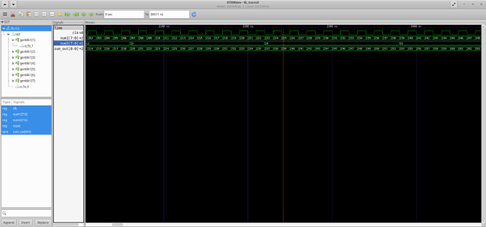

After converting all signal groups to decimal in GTKWave, the waveform is straightforward to verify. `num1` and `num2` are driven across a range of input combinations, and the 9-bit `sum` output matches `num1 + num2` for every case. Inputs that individually fit in 8 bits produce a `sum[8] = 0`, while combinations that overflow 255 correctly produce `sum[8] = 1` in the MSB. The adder handles both normal and overflow conditions accurately, validating the `generate`-based chaining of full adder stages throughout the 8-bit chain.

**Synthesis:**

First synthesize the full adder alone to verify the base cell:

```bash
yosys
read_liberty -lib ../lib/sky130_fd_sc_hd__tt_025C_1v80.lib
read_verilog fa.v
synth -top fa
abc -liberty ../lib/sky130_fd_sc_hd__tt_025C_1v80.lib
show
```

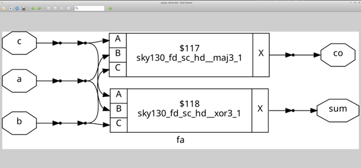

The single full adder maps to a compact cluster of standard cells — an XOR chain for the sum bit and a carry-generate cell for the carry-out. This is the basic building block that the `generate` loop will replicate 7 more times inside the RCA.

Then synthesize the full RCA:

```bash
yosys
read_liberty -lib ../lib/sky130_fd_sc_hd__tt_025C_1v80.lib
read_verilog fa.v rca.v
synth -top rca
abc -liberty ../lib/sky130_fd_sc_hd__tt_025C_1v80.lib
write_verilog -noattr rca_net.v
show
```

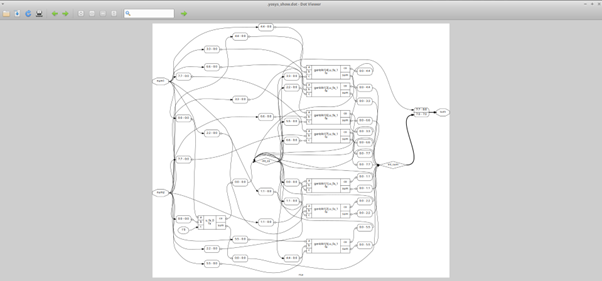

The full RCA schematic shows all 8 full adder stages laid out in a chain. The carry signal threads from stage 0 through to stage 7, and the sum bits fan out as outputs. The structure visually matches the ripple carry concept — each stage depends on the carry from the previous one, and the carry must propagate through the full chain before the MSB of the sum is valid. The `generate` loop produced exactly the same netlist that 8 manual instantiations would have, just with a fraction of the source code.

**✅ GLS Simulation:**

```bash
iverilog ../my_lib/verilog_model/primitives.v ../my_lib/verilog_model/sky130_fd_sc_hd.v rca_net.v tb_rca.v
./a.out
gtkwave tb_rca.vcd
```

> **Note on `rca_net.v`:** During GLS, the `fa` module is already flattened into the netlist — no need to include `fa.v` separately. If a module-not-found error appears during synthesis (not GLS), ensure both `fa.v` and `rca.v` are passed to `read_verilog` in the same Yosys session.

| RTL Simulation | GLS Simulation |
|:-:|:-:|
|  | 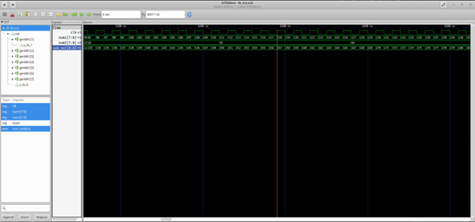 |

Comparing the RTL and GLS waveforms side by side, the `sum` output is bit-accurate across every input combination in both simulations. There is no discrepancy at any point — not in the normal range, not in the overflow cases. This confirms that the `generate`-based RCA synthesizes correctly and that the flattened gate-level netlist faithfully represents the intended 8-bit addition logic. The GLS match closes the verification loop for this design: from RTL code, through synthesis, all the way down to actual standard cell behavior.

---

## 📊 Summary Table

| Design | Type | Simulation | Synthesis | GLS | Hazard |
|--------|------|:---:|:---:|:---:|--------|
| `incomp_if.v` | Combo (IF) | ✅ | ✅ | — | 🔴 Latch inferred (no else) |
| `incomp_if2.v` | Combo (IF) | ✅ | ✅ | — | 🔴 Latch inferred (no final else) |
| `incomp_case.v` | Combo (CASE) | ✅ | ✅ | — | 🔴 Latch inferred (no default) |
| `comp_case.v` | Combo (CASE) | ✅ | ✅ | — | ✅ Clean — default present |
| `partial_case_assign.v` | Combo (CASE) | — | ✅ | — | 🟡 Latch on `x` only |
| `bad_case.v` | Combo (CASE) | ✅ | ✅ | ✅ | 🔴 RTL vs GLS mismatch (wildcard `1?`) |
| `mux_generate.v` | Combo (FOR) | ✅ | — | — | ✅ Clean loop-based MUX |
| `demux_case.v` | Combo (CASE) | ✅ | ✅ | — | ✅ Clean 1×8 demux |
| `demux_generate.v` | Combo (FOR) | ✅ | ✅ | ✅ | ✅ GLS match |
| `fa.v` | Combo | ✅ | ✅ | — | ✅ Full adder |
| `rca.v` | Combo (GENERATE) | ✅ | ✅ | ✅ | ✅ GLS match |

---

## 🔗 Back to Main Repo

[⬅ RTL Design Workshop — Main Repository](https://github.com/Saicharan-malyala/RTL-Design-Workshop)

---

*Verilog source files sourced from [kunalg123/sky130RTLDesignAndSynthesisWorkshop](https://github.com/kunalg123/sky130RTLDesignAndSynthesisWorkshop) under CC BY 4.0.*