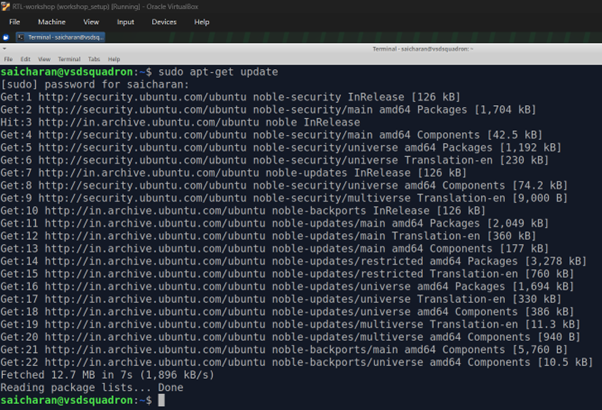
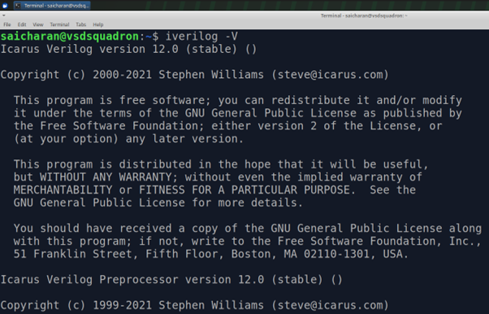
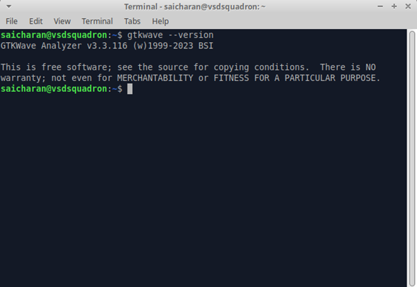
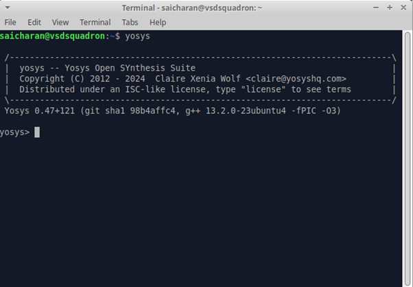

# 🛠️ Tools Installation Guide

[](https://ubuntu.com/)
[](https://steveicarus.github.io/iverilog/)
[](http://gtkwave.sourceforge.net/)
[](https://yosyshq.net/yosys/)

This folder documents how I set up the three core open-source tools used throughout the VSD RTL Design and Synthesis Workshop. Everything runs on Ubuntu (inside Oracle VirtualBox in my case — the VSD-provided `workshop_setup` VM image).

> 💡 All commands are run from the terminal. No GUI package managers used.

---

## 📋 Table of Contents

- [Environment Overview](#-environment-overview)
- [Step 0 — Update Package Lists](#-step-0--update-package-lists)
- [Tool 1 — iverilog](#-tool-1--iverilog)
- [Tool 2 — GTKWave](#-tool-2--gtkwave)
- [Tool 3 — Yosys](#-tool-3--yosys)
- [Tool Flow Summary](#-tool-flow-summary)

---

## 🖥️ Environment Overview

| Item | Details |
|------|---------|
| OS | Ubuntu 24.04 (Noble) |
| Host | Oracle VirtualBox — VSD workshop VM |
| Terminal | XFCE Terminal (dark theme) |
| User | `saicharan@vsdsquadron` |
| Install method | `apt-get` for all three tools |

The VSD workshop comes with a pre-configured Ubuntu VM (`RTL-workshop (workshop_setup)`) that has internet access and a working `apt` setup. I installed all tools fresh on this machine.

---

## ⚡ Step 0 — Update Package Lists

Before installing anything, I updated the package lists to make sure `apt` pulls the latest available versions.

```bash
sudo apt-get update
```



The `Fetched 12.7 MB` line and `Reading package lists... Done` at the bottom confirm that all package sources refreshed successfully. This step prevents version mismatches during installation.

---

## 🔵 Tool 1 — iverilog

### What it does

`iverilog` (Icarus Verilog) is an open-source Verilog simulation compiler. I write a Verilog design and a testbench, compile them together using `iverilog`, and it produces a simulation executable. Running that executable generates a `.vcd` (Value Change Dump) waveform file that I then view in GTKWave.

In short: **iverilog turns Verilog source code into a running simulation.**

### Installation

```bash
sudo apt-get install iverilog
```

When prompted `Do you want to continue? [Y/n]`, type `Y` and press Enter. The install completes in under a minute on a normal connection.

### Verify Installation

```bash
iverilog -V
```



The key line to look for is:

```
Icarus Verilog version 12.0 (stable)
```

This confirms `iverilog` is installed and working. Version 12.0 is the stable release used throughout this workshop.

---

## 🟢 Tool 2 — GTKWave

### What it does

GTKWave is a waveform viewer. After `iverilog` runs a simulation and dumps a `.vcd` file, I open that file in GTKWave to visually inspect signal transitions over time. It is essential for debugging RTL designs — instead of staring at numbers, I can see clock edges, input/output relationships, and timing all at once.

In short: **GTKWave is how I read and debug simulation results.**

### Installation

```bash
sudo apt-get install gtkwave
```

### Verify Installation

```bash
gtkwave --version
```



The version line confirms the install:

```
GTKWave Analyzer v3.3.116 (w)1999-2023 BSI
```

Version 3.3.116 is what the workshop uses. To launch it and open a waveform file later, the command is:

```bash
gtkwave <filename>.vcd
```

---

## 🔴 Tool 3 — Yosys

### What it does

Yosys is an open-source logic synthesis framework. It takes my Verilog RTL design as input and maps it to actual logic gates using a cell library (in this workshop, the SKY130 PDK standard cells). This is the synthesis step in the RTL-to-GDSII flow.

In short: **Yosys converts human-readable RTL into a gate-level netlist using real standard cells.**

### Installation

```bash
sudo apt-get install yosys
```

### Verify Installation

Run the Yosys shell:

```bash
yosys
```



The important things to confirm here are:

- The banner showing `yosys -- Yosys Open SYnthesis Suite`
- The version line: `Yosys 0.47+121 (git sha1 98b4affc4)`
- The `yosys>` prompt — this is the interactive Yosys shell where synthesis commands are run

To exit the Yosys shell:

```bash
exit
```

---

## 🔄 Tool Flow Summary

Here is how the three tools connect in the workshop workflow:

```
┌─────────────────────────────────────────────────────────┐
│                  RTL Design Workflow                    │
├─────────────────────────────────────────────────────────┤
│                                                         │
│   design.v + testbench.v                               │
│           │                                             │
│           ▼                                             │
│       [ iverilog ]  ──── compiles & simulates ────►    │
│           │                                             │
│           ▼                                             │
│       dump.vcd                                          │
│           │                                             │
│           ▼                                             │
│       [ GTKWave ]  ──── view waveforms ──────────►     │
│                                                         │
│   design.v + SKY130 .lib                               │
│           │                                             │
│           ▼                                             │
│       [ Yosys ]    ──── synthesize to gates ──────►    │
│           │                                             │
│           ▼                                             │
│       netlist.v (gate-level)                           │
│                                                         │
└─────────────────────────────────────────────────────────┘
```

| Tool | Role in Workshop | When I Use It |
|------|-----------------|---------------|
| `iverilog` | Simulation compiler | Every lab — compile + run testbench |
| `GTKWave` | Waveform viewer | Every lab — view and debug output |
| `Yosys` | Logic synthesizer | Day 1 onwards — synthesize RTL to gates |

---

> 📁 **Screenshots in this folder:** `terminal_update.png`, `iverilog_version.png`, `gtkwave_version.png`, `yosys_launch.png`
>
> 🔙 **Back to main repo:** [RTL-Design-Workshop](../README.md)